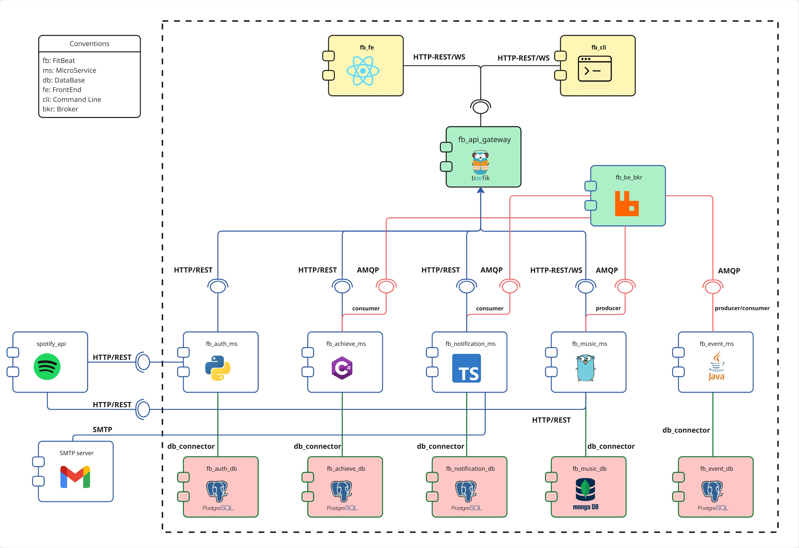
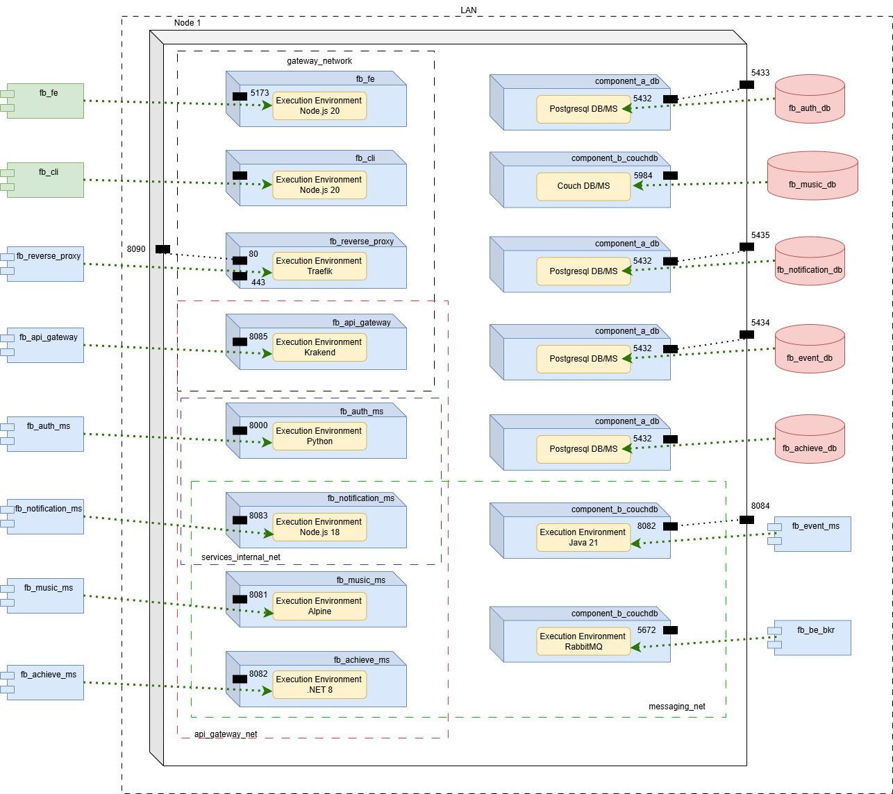
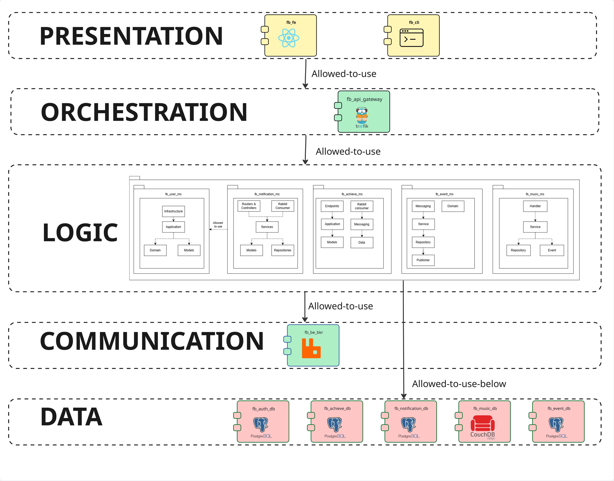
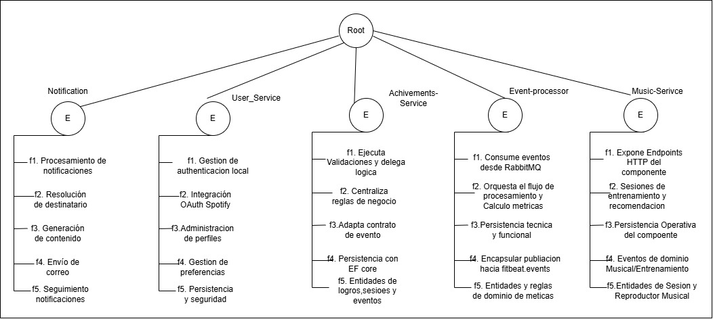

# Project: Prototype 2 - Advanced Architectural Structures

## Team 1e

### Team Members
- Nicolas Felipe Arciniegas Lizarazo
- Karen Lorena Guzman Del Rio
- Juan David Chacon Muñoz
- Adrian Yebid Rincon
- Pablo Felipe Sandoval Menjura
- Julio Cesar Albadan Sarmiento

## Software System

### Name
FitBeat

### Logo


### Description
FitBeat is a distributed fitness platform that synchronizes workout sessions with Spotify playback. A user can sign up or log in, connect a Spotify account, configure music preferences, and start a training session. During the session, playback can be controlled in real time, while business events are emitted and consumed asynchronously for achievements, analytics, and notifications.

The current prototype uses a microservice architecture with dedicated persistence per domain, a two-layer gateway stack (Traefik as reverse proxy + KrakenD as API Gateway) for entry-point orchestration, and a message broker for asynchronous workflows.

## Prototype 2 Requirements Coverage

### Functional completeness
The team-defined functional scope currently includes:
- User registration and authentication.
- Spotify OAuth connection.
- Training session creation and playback control.
- Achievement evaluation and retrieval.
- Event-driven notification processing.

### Non-functional requirements mapping
- Distributed architecture: satisfied through independently deployable services.
- At least two presentation components: satisfied (`frontend/web` and `frontend/cli`).
- Web frontend with SSR subarchitecture: satisfied (`frontend/web-ssr` built with Next.js SSR; legacy CSR frontend remains available under optional profile).
- At least five logic components: satisfied (`user-service`, `music-service`, `achievements-service`, `notification-service`, `event-processor`).
- At least one communication/orchestration component: satisfied (`traefik` as reverse proxy, `krakend` as dedicated API Gateway, plus `rabbitmq` for async orchestration).
- At least four data components including relational and NoSQL: satisfied (multiple PostgreSQL databases + CouchDB).
- At least one asynchronous processing component: satisfied (`event-processor`, plus async consumers in achievements/notifications).
- HTTP-based connectors: satisfied (REST APIs through gateway and direct service endpoints).
- At least five general-purpose programming languages: satisfied (Python, Go, C#, TypeScript/JavaScript, Java).
- Container-oriented deployment: satisfied (Docker Compose deployment model).

## Horizontal Scaling Implementation

FitBeat now implements **horizontal scaling** using KrakenD-based load balancing. This allows the system to handle increased load by distributing requests across multiple service replicas.

### Scaled Services

| Service | Replicas | Load Balancer | Strategy |
|---------|----------|---------------|----------|
| User Service | 3 | KrakenD | Round-robin |
| Music Service | 3 | KrakenD | Round-robin |
| Achievements Service | 3 | KrakenD | Round-robin |
| Notification Service | 3 | KrakenD | Round-robin |
| Event Processor | 2 | RabbitMQ | Consumer groups |

### Performance Improvements

- **3× throughput** for HTTP-based services
- **Automatic failover** if a replica fails
- **Zero downtime** during replica restarts
- **Maintained network segmentation** and security patterns

### Documentation

- **Implementation Guide**:
- **Testing**: Run `./scaling-patterns/test_load_balancing.sh`
- **Monitoring**: `docker stats` and `docker-compose logs -f [service]`

### Quick Start with Scaling

```bash
# Deploy all replicas
docker-compose up -d --build

# Verify load balancing
cd scaling-patterns
./test_load_balancing.sh

# Monitor distribution
docker logs -f fb_music_ms_1 fb_music_ms_2 fb_music_ms_3
```


## Architectural Structures

### 1. Component-and-Connector Structure

#### C&C View


#### Architectural styles used
- Layered architecture:
  - The system can be organized into four tiers: presentation, communication/orchestration, logic, and data.
  - Each tier has a clear responsibility boundary and depends on explicit contracts.
- Client-server style:
  - Frontends act as clients and backend services expose server endpoints.
  - Requests are served mainly through HTTP APIs, with WebSocket support for real-time interaction.
- Microservice-based architecture:
  - Business capabilities are split into independently deployable services.
  - Each service owns its domain logic and can evolve with minimal coupling to other services.
- Distributed architecture:
  - Components run in separate containers and communicate through network connectors.
  - The deployment can be distributed across nodes while preserving service contracts.

#### Architectural patterns used
- 4-tier architecture pattern:
  - Presentation tier: `frontend/web`, `frontend/cli`.
  - Communication/orchestration tier: `traefik`, `rabbitmq`.
  - Logic tier: domain microservices.
  - Data tier: PostgreSQL databases and CouchDB.
- API Gateway pattern:
  - A two-layer gateway stack separates edge concerns from API orchestration:
    - `traefik` acts as the reverse proxy and TLS termination point. It receives all inbound traffic and forwards frontend requests directly to `frontend_ssr`, and all API traffic to `krakend`. Traefik has no knowledge of individual microservices.
    - `krakend` acts as the dedicated API Gateway. It exposes a defined set of endpoints and routes each one to the corresponding backend microservice. It is the only component that can reach the backend services network.
  - This separation reduces coupling, improves security (backend services are not reachable from the DMZ network), and allows each layer to evolve independently.
- Broker pattern:
  - `rabbitmq` decouples event producers and consumers.
  - Asynchronous processing avoids blocking user flows and improves resilience for background workloads.
- Database-per-service pattern:
  - Every core service has dedicated persistence boundaries.
  - This prevents direct shared-schema coupling and supports domain autonomy.
- Repository pattern (where applicable):
  - Services encapsulate persistence access behind service-internal data-access modules.
  - This keeps business logic separated from storage-specific operations.

#### Architectural elements and relations

##### Presentation components
  - `frontend/web-ssr` (Next.js SSR):
  - Main user-facing web interface rendered on the server.
  - Communicates with backend services through the gateway.
  - `frontend/web` (React + Vite, legacy CSR profile):
  - Optional compatibility frontend kept for migration safety.
- `frontend/cli` (Node.js):
  - Command-line client for API interactions.
  - Uses the same gateway entry point in container network contexts.

##### Communication and orchestration components
- `traefik` (`fb_gateway`):
  - Edge reverse proxy and TLS termination. Single public entry point on ports `8090` (HTTP) and `443` (HTTPS).
  - Routes by path prefix:
    - `/` → `frontend_ssr` (Next.js SSR frontend).
    - `/api`, `/auth`, `/users`, `/achievements`, `/notifications` → `krakend` (API Gateway).
  - Traefik has no direct knowledge of individual microservices; it only knows the API Gateway.
- `krakend` (`fb_api_gateway`):
  - Dedicated API Gateway. Receives API traffic from Traefik and routes each endpoint to the corresponding backend microservice.
  - Exposes 20 explicitly defined endpoints mapped as follows:
    - `POST /api/auth/register`, `POST /api/auth/login`, `POST /api/auth/refresh`, `GET /api/auth/me` → `user-service`.
    - `GET /auth/login/{id}`, `GET /auth/callback`, `GET /auth/verify-connection/{id}`, `GET /auth/now-playing/{id}` → `user-service` (Spotify OAuth).
    - `POST /users`, `GET /users/{id}`, `PUT /users/{id}/music-preferences` → `user-service`.
    - `GET /api/v1/health`, `POST /api/v1/sessions`, `GET /api/v1/sessions/{id}`, `POST /api/v1/sessions/{id}/finish`, `GET /api/v1/ws` → `music-service` (WebSocket proxied transparently).
    - `GET /achievements/catalog`, `GET /achievements/user/{id}`, `POST /achievements/evaluate` → `achievements-service`.
    - `GET /notifications/user/{id}` → `notification-service`.
  - Operates in `no-op` (transparent proxy) encoding mode: passes headers, body, status codes, and WebSocket upgrades without modification.
  - Runs on internal port `8085`, reachable from `gateway_network` (via Traefik) and `api_gateway_net` (towards backends).
- `rabbitmq` (`fb_rabbitmq`):
  - Event broker for asynchronous interactions.
  - Decouples event producers and consumers.

##### Logic-type components
- `user-service` (FastAPI, Python):
  - Authentication, local user management, JWT, Spotify OAuth token management.
  - Relational persistence in PostgreSQL (`fb_users_db`).
- `music-service` (Go):
  - Training session and playback orchestration with Spotify integration.
  - Document persistence in CouchDB (`fb_music_db`).
  - Publishes domain events to RabbitMQ.
- `achievements-service` (.NET 8):
  - Achievement rules and badge assignment.
  - Relational persistence in PostgreSQL (`fb_achievements_db`).
  - Consumes asynchronous events for gamification updates.
- `notification-service` (TypeScript/Node.js):
  - Notification generation and persistence.
  - Email dispatch and user-notification query endpoints.
  - Relational persistence in PostgreSQL (`fb_notification_db`).
  - Consumes asynchronous events from RabbitMQ.
- `event-processor` (Spring Boot, Java):
  - Asynchronous event processing and metric/stat aggregation.
  - Relational persistence in PostgreSQL (`fb_event_db`).

##### Data components
- `fb_users_db` (PostgreSQL): user and auth-related data.
- `fb_music_db` (CouchDB): workout session documents and music-related records.
- `fb_achievements_db` (PostgreSQL): achievements and progression data.
- `fb_notification_db` (PostgreSQL): notification records and delivery outcomes.
- `fb_event_db` (PostgreSQL): processed-event tracking and derived metrics.

##### External system
- Spotify API:
  - OAuth integration (via user service).
  - Playback/search integration (via music service).

### 2. Deployment Structure

#### Deployment View


#### Architectural elements and relations
- Deployment model is container-oriented on a Docker host.
- Docker networks (segmented by responsibility zone):
  - `gateway_network` (public DMZ): `traefik`, `krakend`, `frontend_ssr`, `frontend` (optional), `frontend_cli` (optional).
  - `api_gateway_net` (internal API zone): `krakend`, `user-service`, `music-service`, `achievements-service`, `notification-service`. Backend microservices are **not** present in `gateway_network`, so Traefik cannot reach them directly.
  - `users_db_net`, `music_db_net`, `achievements_db_net`, `notification_db_net`, `events_db_net` (isolated data zones): each database network is accessible only by its owning service.
  - `messaging_net` (broker zone): RabbitMQ visible only to its producers/consumers.
  - `services_internal_net` (service-to-service): direct channel from `notification-service` to `user-service` for user contact lookup.
- Core deployment allocation (`deployed_in`):
  - Reverse proxy logic -> `fb_gateway` (Traefik).
  - API Gateway logic -> `fb_api_gateway` (KrakenD).
  - User logic -> `fb_users_ms`.
  - Music logic -> `fb_music_ms`.
  - Achievements logic -> `fb_achievements_ms`.
  - Notification logic -> `fb_notification_ms`.
  - Event processing logic -> `fb_event_processor`.
  - Web presentation SSR -> `fitbeat_frontend_ssr`.
  - Legacy web presentation (optional) -> `fitbeat_frontend`.
  - CLI presentation -> `fitbeat_cli`.
  - Persistence components -> dedicated DB containers.
  - Async transport -> `fb_rabbitmq`.

#### Runtime environments by component
- `fb_gateway`: Traefik v3.1 runtime (reverse proxy).
- `fb_api_gateway`: KrakenD v2.7 runtime (API Gateway).
- `fb_users_ms`: Python 3.11 + Uvicorn ASGI server.
- `fb_music_ms`: Go compiled binary on Alpine runtime.
- `fb_achievements_ms`: .NET 8 ASP.NET Core runtime (`dotnet`).
- `fb_notification_ms`: Node.js 18 runtime (`node dist/index.js`).
- `fb_event_processor`: Java 21 runtime (`java -jar app.jar`).
- `fitbeat_frontend_ssr`: Node.js 20 + Next.js SSR runtime.
- `fitbeat_frontend`: Node.js 20 + Vite dev server (legacy CSR profile).
- `fitbeat_cli`: Node.js 20 runtime.

#### Port exposure summary
- Traefik (reverse proxy): `8090:80` (HTTP), `443:443` (HTTPS), Dashboard: `8088:8080`.
- KrakenD (API Gateway): `8085:8085`.
- User service: `8000:8000`.
- Music service: `8081:8081`.
- Achievements service: `8082:8082`.
- Notification service: `8083:8083`.
- Event processor: `8084:8082`.
- Web SSR frontend: `3000:3000`.
- Databases:
  - `fb_achievements_db`: `5432:5432`
  - `fb_users_db`: `5433:5432`
  - `fb_event_db`: `5434:5432`
  - `fb_notification_db`: `5435:5432`
  - `fb_music_db`: `5984:5984`
- RabbitMQ: `5672:5672`, management UI `15672:15672`.

#### Deployment patterns used
- Container-oriented deployment:
  - Every major component runs in an isolated container with explicit runtime dependencies.
  - This enables reproducible local deployment and portable execution environments.
- Two-layer gateway pattern:
  - `traefik` acts as edge reverse proxy: TLS termination, path-based routing to either the frontend or the API Gateway. It has no direct connection to backend microservices.
  - `krakend` acts as dedicated API Gateway: receives API traffic from Traefik, applies endpoint-level routing to the appropriate microservice. It bridges `gateway_network` and `api_gateway_net`.
  - This separation allows Traefik to be replaced or reconfigured without touching API routing logic, and vice versa.
- Network segmentation pattern (defense in depth):
  - `gateway_network` (DMZ): public-facing zone; only Traefik, KrakenD, and frontend containers reside here.
  - `api_gateway_net`: internal zone; KrakenD and backend microservices. Not reachable from Traefik directly.
  - Per-service DB networks: each database is isolated with only its owning service as peer.
  - `messaging_net`: dedicated broker network.
  - `services_internal_net`: direct service-to-service channel (notification → user).
- Dedicated storage pattern:
  - Data services are isolated in dedicated containers per bounded domain.
  - This supports ownership and independent scaling/evolution decisions.

### 3. Layered Structure

#### Layered View


#### Layer definitions and relations
- Layer 1 - Presentation:
  - `frontend/web-ssr`, `frontend/web` (optional), `frontend/cli` (optional).
- Layer 2 - Entry and Communication:
  - `traefik` (edge reverse proxy): receives external traffic, terminates TLS, routes to frontend or API Gateway.
  - `krakend` (API Gateway): receives API traffic from Traefik, enforces endpoint contracts, routes to domain services.
  - `rabbitmq` (async transport): decouples event producers from consumers.
- Layer 3 - Application and Domain Logic:
  - `user-service`, `music-service`, `achievements-service`, `notification-service`, `event-processor`.
- Layer 4 - Data:
  - PostgreSQL instances and CouchDB.

Dependency rule:
- Presentation depends on entry/communication layer.
- Domain services depend on data and asynchronous messaging layers.
- Direct cross-layer shortcuts are limited to defined API/message contracts.

#### Layered patterns used
- N-tier (4-tier) organization:
  - Enforces a high-level separation between UI, communication/orchestration, business logic, and data.
  - Improves maintainability by reducing cross-cutting dependencies.
- Two-layer gateway as communication boundary:
  - Traefik and KrakenD together form the communication layer, each with a distinct responsibility.
  - Traefik handles edge concerns (TLS, routing to frontend vs. API); KrakenD handles API concerns (endpoint mapping, backend selection).
  - This increases separation of concerns within the layer itself and simplifies policy evolution at each level independently.
- Broker-mediated asynchronous collaboration:
  - Event-based interactions are delegated to the messaging tier.
  - This reduces temporal coupling between producer and consumer services.
- Domain-oriented service layering:
  - Logic-tier services focus on distinct responsibilities and coordinate through contracts.
  - This preserves cohesion and limits impact radius of changes.

### 4. Decomposition Structure

#### Decomposition View


#### Decomposition of the system
- `FitBeat System`
  - `Presentation Subsystem`
    - Web Frontend SSR (`frontend/web-ssr`)
    - Web Frontend Legacy CSR (`frontend/web`, optional)
    - CLI Frontend (`frontend/cli`)
  - `Identity Subsystem`
    - User Service (`user-service`)
  - `Workout and Playback Subsystem`
    - Music Service (`music-service`)
  - `Gamification Subsystem`
    - Achievements Service (`achievements-service`)
  - `Notification Subsystem`
    - Notification Service (`notification-service`)
  - `Async Processing Subsystem`
    - Event Processor (`event-processor`)
  - `Infrastructure Subsystem`
    - Reverse Proxy (`traefik`)
    - API Gateway (`krakend`)
    - Broker (`rabbitmq`)
    - Databases (PostgreSQL, CouchDB)
  - `External Integration Subsystem`
    - Spotify API

#### Decomposition patterns used
- Functional decomposition by business capability:
  - The system is partitioned into identity, workout/playback, achievements, notifications, and async processing.
  - Each subsystem owns a bounded part of the platform behavior.
- Infrastructure decomposition:
  - Gateway, broker, and persistence are separated from domain services as dedicated infrastructure modules.
  - This clarifies operational responsibilities and runtime dependencies.
- Integration decomposition:
  - Spotify integration is treated as an external subsystem boundary.
  - External dependencies are isolated behind service interfaces.
- High cohesion and loose coupling principle:
  - Internal module responsibilities are focused.
  - Inter-service dependencies are mediated through REST/WebSocket/AMQP contracts.

## Prototype

### Local deployment instructions
1. Clone the repository:
```bash
git clone https://github.com/adrianyebid/FitBeat.git
cd FitBeat
```
2. Create `.env` from `.env.example` and fill required credentials:
- Spotify credentials (`SPOTIFY_CLIENT_ID`, `SPOTIFY_CLIENT_SECRET`).
- Database and messaging environment variables.
3. Build and run all services:
```bash
docker-compose up --build
```
4. Check container status:
```bash
docker-compose ps
```
5. Main access points:
- Web frontend (SSR): `http://localhost:3000`
- Traefik (edge entry point): `http://localhost:8090`
- Traefik dashboard: `http://localhost:8088`
- KrakenD (API Gateway, direct): `http://localhost:8085`
- RabbitMQ dashboard: `http://localhost:15672`

### High-level functional flow
1. User signs up or logs in.
2. User connects Spotify account.
3. User configures workout/music preferences.
4. User starts training session.
5. Playback is controlled in real time.
6. Domain events are emitted and consumed asynchronously.
7. User checks achievements and notifications.

## Notes
- Export this file to PDF as `p2_1e.pdf`.
- Ensure all required images are embedded in the final exported document:
  - Logo
  - C&C View
  - Deployment View
  - Layered View
  - Decomposition View
