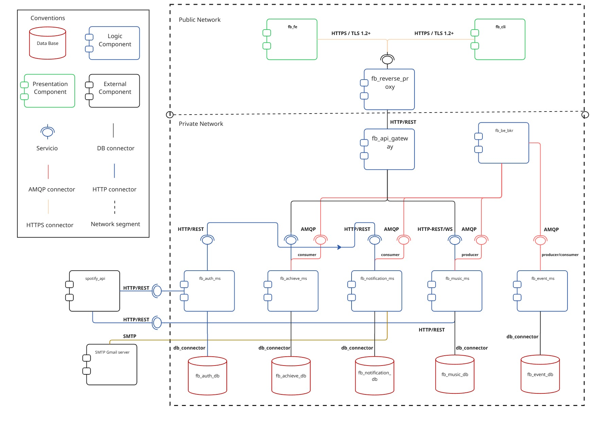
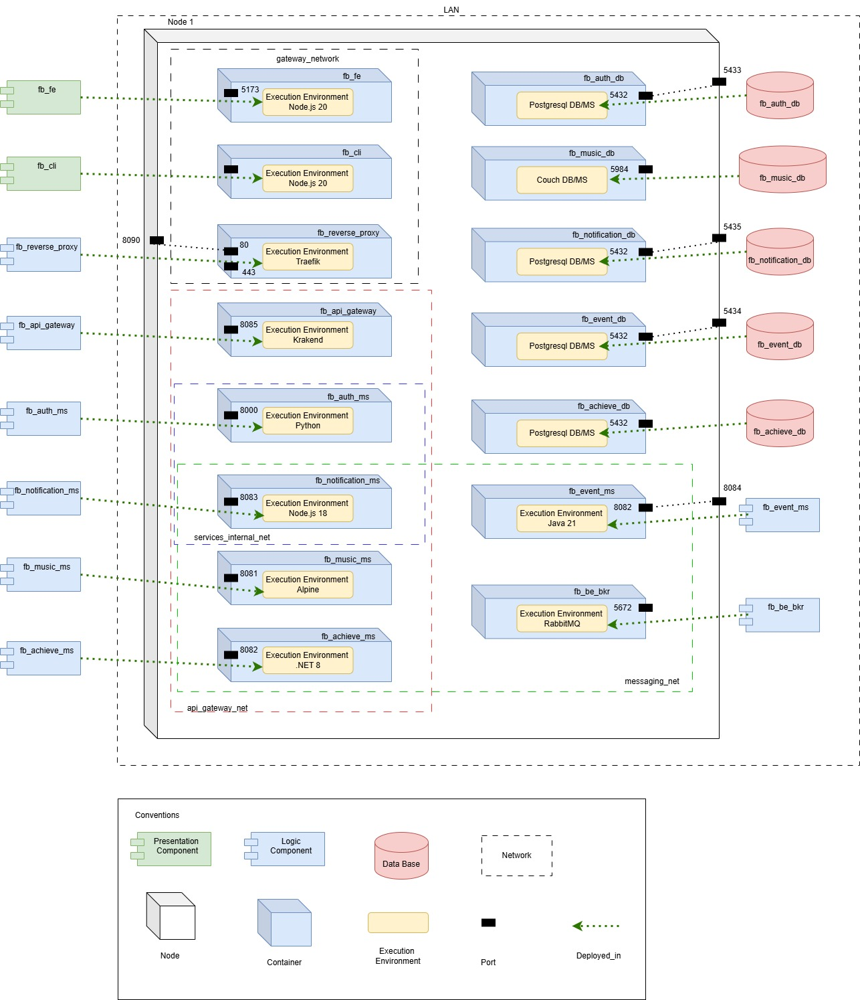
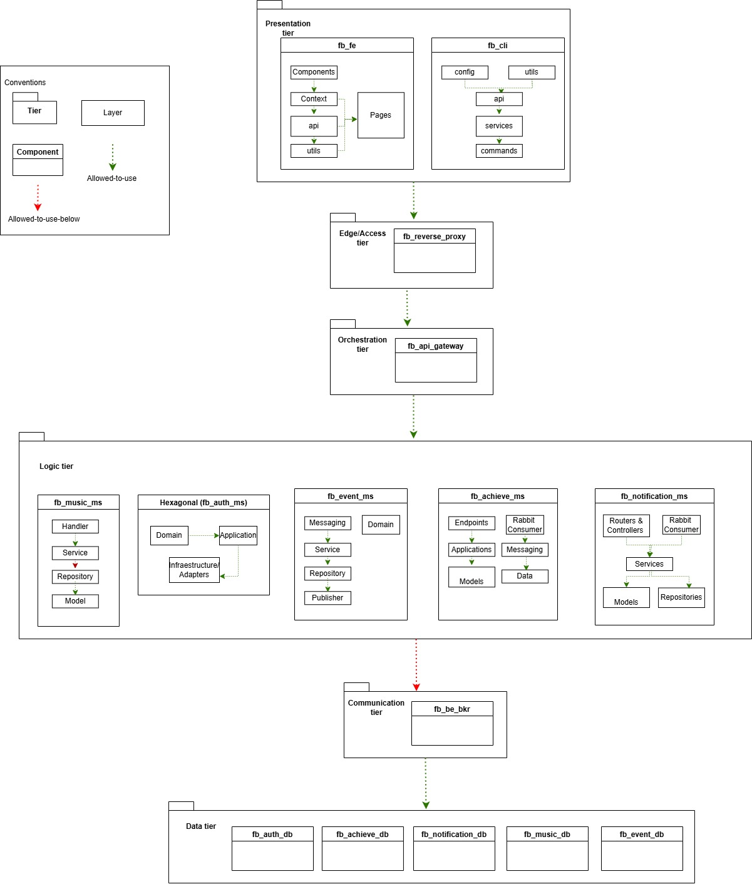
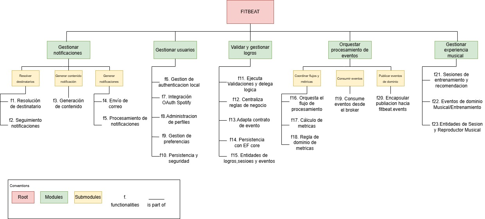
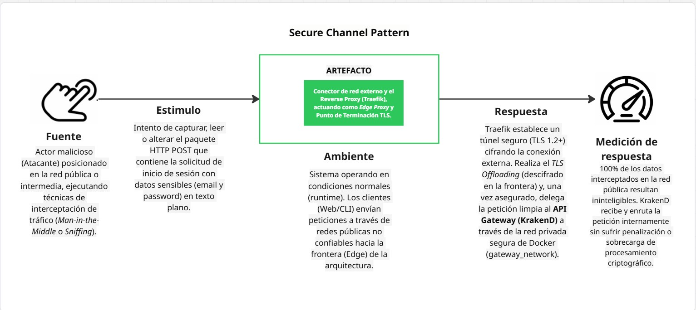
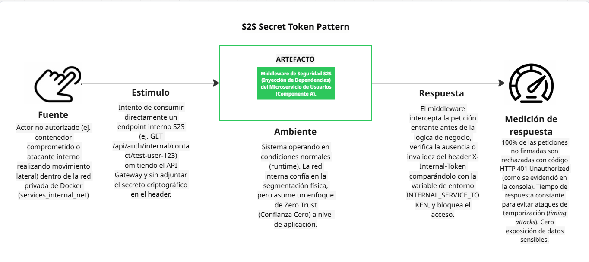
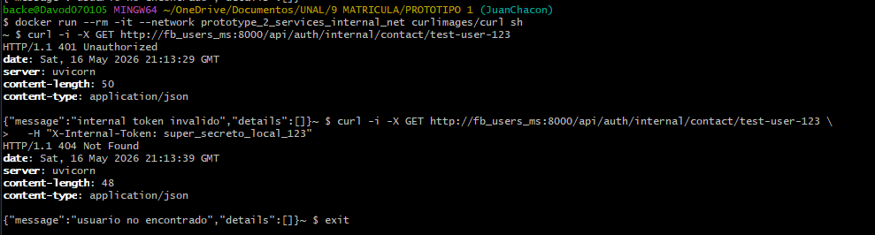
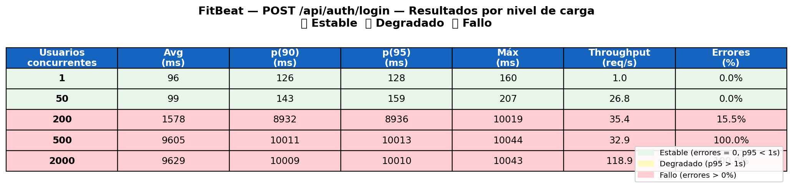
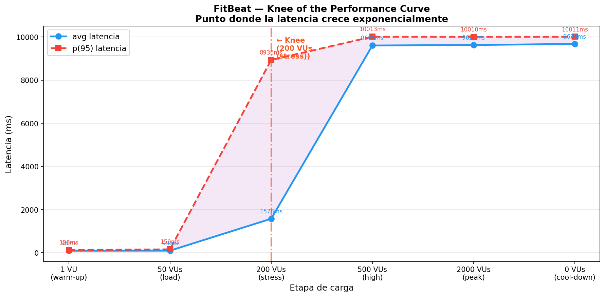

# Project: Prototype 3 - Quality Attributes, Part 1

## Team

### Name
1e

### Team members
- Nicolas Felipe Arciniegas Lizarazo
- Karen Lorena Guzman Del Rio
- Juan David Chacon Munoz
- Adrian Yebid Rincon
- Pablo Felipe Sandoval Menjura
- Julio Cesar Albadan Sarmiento

## Software System

### Name
FitBeat

### Logo


### Description
FitBeat is a distributed fitness platform that synchronizes workout sessions with Spotify playback. A user can sign up or log in, connect a Spotify account, configure music preferences, and start a training session. During the session, playback can be controlled in real time, while business events are emitted and consumed asynchronously for achievements, analytics, and notifications.

The third prototype redesigns the previous architecture by separating the public edge from the API orchestration responsibilities. Traefik is now modeled as the reverse proxy at the system boundary, KrakenD remains as the API Gateway in the orchestration tier, and backend services are isolated through segmented Docker networks and service-owned persistence.

### Functional completeness
The team-defined functional scope for this prototype includes:
- User registration, login, JWT session management, and Spotify OAuth connection.
- Music preference management for training personalization.
- Training session creation and real-time playback control through HTTP and WebSocket.
- Event emission from training activity to asynchronous consumers.
- Achievement evaluation and progress retrieval.
- Notification generation and persistence from business events.
- Secure external access through HTTPS, reverse proxy routing, API gateway contracts, network segmentation, and service-to-service shared-secret validation.

## Architectural Structures

### 1. Component-and-Connector Structure

#### C&C View


#### Description of architectural elements and relations

##### Presentation components
- `frontend/web` (React + Vite): client-side web interface used by end users to authenticate, configure preferences, start training sessions, control playback, and review achievements.
- `frontend/web-ssr` (Next.js): server-rendered web component used as the official presentation component for the delivery and runtime checks.
- `frontend/cli` (Node.js): command-line client that executes authentication, dashboard, training, and player-control workflows.

##### Edge and orchestration components
- `fb_gateway` (`traefik`): reverse proxy located at the public boundary. It receives HTTP/HTTPS traffic, terminates TLS, applies CORS middleware, and forwards API traffic only to KrakenD. It also routes the SSR frontend.
- `fb_api_gateway` (`krakend`): API Gateway and orchestration facade. It exposes an explicit endpoint contract and routes requests to the corresponding backend service.
- `fb_broker` (`rabbitmq`): asynchronous message broker used for event publication and consumption between backend services.

##### Logic-type components
- `user-service` (`user_service`, Python/FastAPI): manages users, local authentication, JWTs, Spotify OAuth, and internal contact/token endpoints.
- `music-service` (`music_service`, Go): manages training sessions, Spotify playback orchestration, WebSocket player commands, and event publication.
- `achievements-service` (`achievements_service`, .NET 8): evaluates achievement rules, stores badge progress, and consumes training-related events.
- `notification-service` (`notification_service`, TypeScript/Node.js): consumes events, obtains user contact data through authorized S2S calls, persists notifications, and dispatches email messages.
- `event-processor` (Java/Spring Boot): consumes training events and computes derived metrics and statistics.

##### Data components
- `fb_users_db` (PostgreSQL): user, credential, token, and preference data.
- `fb_music_db` (CouchDB): training session and music-session documents.
- `fb_achievements_db` (PostgreSQL): achievement catalog, progress, and processed inbound events.
- `fb_notification_db` (PostgreSQL): notification records and delivery information.
- `fb_event_db` (PostgreSQL): processed event records and derived metrics.

##### External systems
- Spotify API: external provider used for OAuth, playback, current-track information, and music control.
- Email provider: external service used by the notification service to send messages.

##### Main relations and connectors
| Connector | Producer | Consumer | Description |
|---|---|---|---|
| HTTPS/HTTP request-reply | Web, SSR, CLI clients | Traefik | External clients access the system through the reverse proxy. HTTPS is used for secure-channel scenarios. |
| HTTP reverse proxy | Traefik | KrakenD | Traefik forwards API path prefixes to KrakenD and hides backend topology. |
| REST/HTTP | KrakenD | Backend services | KrakenD routes public API contracts to `user-service`, `music-service`, `achievements-service`, and `notification-service`. |
| WebSocket | Client player UI/CLI | `music-service` through gateway path | Real-time playback commands are sent during an active training session. |
| AMQP | `music-service` and other producers | RabbitMQ consumers | Business events are published to queues/exchanges for asynchronous processing. |
| DB connectors | Microservices | Owned databases | Each service accesses only its own persistence component. |
| HTTPS external API | `user-service`, `music-service` | Spotify API | OAuth, token refresh, and playback interactions. |
| Internal HTTP + `X-Internal-Token` | `notification-service` | `user-service` | Authorized service-to-service access to internal contact data. |

#### Description of architectural styles and patterns used
- **Microservices style:** FitBeat is decomposed into independently deployable backend services aligned with business capabilities: identity, workout/playback, achievements, notifications, and event processing.
- **Client-server style:** Frontends act as clients and backend components expose HTTP/WebSocket interfaces through controlled entry points.
- **Distributed architecture:** Components run in separate containers and communicate through network connectors, which introduces latency and partial-failure concerns handled through explicit contracts and asynchronous messaging.
- **Event-driven collaboration:** Training and business events are delivered through RabbitMQ so producers and consumers do not depend on each other's availability.
- **API Gateway pattern:** KrakenD provides a single API facade and exposes only whitelisted endpoints.
- **Reverse Proxy pattern:** Traefik protects the edge, terminates TLS, applies routing policies, and prevents clients from seeing internal service addresses.
- **Broker pattern:** RabbitMQ decouples fast producers from asynchronous consumers.
- **Database-per-service pattern:** Each service owns its persistence boundary and avoids shared database coupling.
- **Secure Channel pattern:** HTTPS/TLS protects external requests that may contain credentials or tokens.
- **Secret Token pattern:** Internal HTTP endpoints are protected with a shared `X-Internal-Token` header.

### 2. Deployment Structure

#### Deployment View


#### Description of architectural elements and relations

##### Deployment environment
The prototype is deployed with Docker Compose on a single host. Each major component runs in an independent container with its own runtime image, environment variables, ports, health checks, and Docker network memberships.

##### Nodes and containers
- Host node: physical or virtual machine running Docker Engine and Docker Compose.
- `fb_gateway`: Traefik reverse proxy container.
- `fb_api_gateway`: KrakenD API Gateway container.
- `fitbeat_frontend`: React + Vite frontend container, used under the `legacy-csr` profile.
- `fitbeat_frontend_ssr`: Next.js SSR frontend container.
- `fitbeat_cli`: Node.js CLI container.
- `fb_users_ms`, `fb_music_ms`, `fb_achievements_ms`, `fb_notification_ms`, `fb_event_processor`: backend service containers.
- `fb_users_db`, `fb_music_db`, `fb_achievements_db`, `fb_notification_db`, `fb_event_db`: persistence containers.
- `fb_rabbitmq`: AMQP broker and management UI container.

##### Runtime environments
- Traefik v3.1 for reverse proxy, TLS, and routing.
- KrakenD 2.7 for API gateway contracts and backend forwarding.
- Node.js runtime for CSR frontend, SSR frontend, CLI, and notification service.
- Python 3.11 + Uvicorn/FastAPI for user service.
- Go runtime/binary for music service.
- .NET 8 runtime for achievements service.
- Java 21 runtime for event processor.
- PostgreSQL, CouchDB, and RabbitMQ for infrastructure services.

##### Networks
- `gateway_network`: DMZ/public access zone containing Traefik, KrakenD, frontends, and CLI.
- `api_gateway_net`: internal API zone connecting KrakenD with backend microservices.
- `users_db_net`, `music_db_net`, `achievements_db_net`, `notification_db_net`, `events_db_net`: internal database networks dedicated to each service and its database.
- `messaging_net`: internal AMQP zone for RabbitMQ and event producers/consumers.
- `services_internal_net`: explicit internal channel between `notification-service` and `user-service`.

##### Main deployment relations
- External clients -> host ports `8090`/`443` -> `fb_gateway`.
- `fb_gateway` -> `fb_api_gateway` through `gateway_network`.
- `fb_api_gateway` -> backend microservices through `api_gateway_net`.
- Each microservice -> owned database through its dedicated internal database network.
- Event producers/consumers -> `fb_rabbitmq` through `messaging_net`.
- `fitbeat_frontend_ssr` -> Traefik/KrakenD using `NEXT_PUBLIC_GATEWAY_URL`.

#### Description of architectural patterns used
- **Container-based deployment:** Every application and infrastructure component is packaged in a container, making runtime dependencies explicit and reproducible.
- **Edge reverse proxy deployment:** Traefik is deployed at the system boundary to receive all external traffic and enforce edge policies.
- **API Gateway deployment:** KrakenD is deployed behind Traefik and is the only bridge between the public gateway network and backend API network.
- **Network Segmentation pattern:** Docker networks create trust zones for public ingress, API routing, data access, messaging, and explicit S2S channels.
- **Dedicated storage pattern:** Each data store is allocated to the domain service that owns it.
- **Defense-in-depth deployment:** TLS, reverse proxy routing, endpoint whitelisting, network isolation, and shared-secret validation operate as independent protection layers.

### 3. Layered Structure

#### Layered View


#### Description of architectural elements and relations

##### Tier 1 - Client / Presentation
- `frontend/web`, `frontend/web-ssr`, and `frontend/cli`.
- Responsible for user interaction, UI rendering, command-line workflows, session display, and client-side coordination.

##### Tier 2 - Edge / Access
- `traefik`.
- Responsible for public entry, HTTP/HTTPS exposure, TLS termination, CORS middleware, and first-level routing.

##### Tier 3 - Orchestration
- `krakend` and `rabbitmq`.
- KrakenD orchestrates synchronous API access by exposing the backend contract and routing requests.
- RabbitMQ orchestrates asynchronous collaboration by decoupling producers and consumers.

##### Tier 4 - Business Services
- `user-service`, `music-service`, `achievements-service`, `notification-service`, and `event-processor`.
- Responsible for application and domain logic, service-specific validation, event publication/consumption, and integration with external APIs.

##### Tier 5 - Data and Messaging Infrastructure
- PostgreSQL databases, CouchDB, and RabbitMQ storage/queues.
- Responsible for persistence, event durability, and infrastructure-level data management.

##### Dependency rule
The allowed-to-use relation flows from upper tiers to lower tiers:

```text
Client / Presentation
  -> Edge / Access
      -> Orchestration
          -> Business Services
              -> Data and Messaging Infrastructure
```

Backend services may also use the orchestration tier for asynchronous event publication/consumption. Direct access from clients to business services or databases is not part of the intended architecture.

##### Logical layers inside selected components
- `frontend/web`: `presentation -> state/coordinator -> client integration -> external interfaces`.
- `frontend/cli`: `interface -> application workflow -> service -> client integration -> external interfaces`.
- `frontend/web-ssr`: `server-rendered presentation -> server-side integration -> API Gateway`.
- `krakend`: `gateway contract -> routing/composition -> backend integration`.
- `traefik`: `edge entry -> routing -> middleware/policy -> upstream services`.
- `music-service`: `handler -> service -> repository -> model`, with service-level access to model objects.

#### Description of architectural patterns used
- **N-tier architecture:** The system is organized into five tiers: presentation, edge/access, orchestration, business services, and data/infrastructure.
- **Separated edge and orchestration layers:** Traefik and KrakenD are intentionally placed in different tiers because Traefik handles public access concerns while KrakenD handles API contract and backend routing concerns.
- **Layered style inside services:** Backend services separate handlers/controllers, application services, repositories, and models where applicable.
- **Layered event-driven processing:** Event consumers act as entry points for asynchronous workflows, while service logic and persistence remain separated.
- **Allowed-to-use dependency rule:** Higher tiers depend on lower tiers through explicit HTTP, WebSocket, AMQP, or database connectors.

### 4. Decomposition Structure

#### Decomposition View


#### Description of architectural elements and relations

##### System decomposition
- `FitBeat System`
  - `Presentation Subsystem`
    - Web CSR frontend (`frontend/web`)
    - Web SSR frontend (`frontend/web-ssr`)
    - CLI frontend (`frontend/cli`)
  - `Edge and Access Subsystem`
    - Reverse proxy (`traefik`)
    - TLS certificates and CORS middleware
  - `API Orchestration Subsystem`
    - API Gateway (`krakend`)
    - Public API endpoint contracts
  - `Identity Subsystem`
    - User service
    - Users database
    - Spotify OAuth integration
  - `Workout and Playback Subsystem`
    - Music service
    - Music/session database
    - WebSocket player control
    - Spotify playback integration
  - `Gamification Subsystem`
    - Achievements service
    - Achievements database
  - `Notification Subsystem`
    - Notification service
    - Notification database
    - Email integration
  - `Async Processing Subsystem`
    - Event processor
    - Event database
    - RabbitMQ queues/exchanges
  - `Shared Infrastructure Subsystem`
    - Docker networks
    - RabbitMQ broker
    - Service-to-service shared secret

##### Main relations
- Presentation subsystem depends on the edge/access subsystem for public entry.
- Edge/access subsystem forwards API traffic to API orchestration and SSR traffic to the SSR frontend.
- API orchestration subsystem depends on backend service contracts.
- Business subsystems own their data components and do not share database schemas.
- Workout/playback publishes events consumed by gamification, notifications, and event processing.
- Notification subsystem uses an explicit internal channel to request user contact data from the identity subsystem.
- External integrations are encapsulated behind the services that need them.

#### Description of architectural patterns used
- **Functional decomposition by business capability:** Services are organized by domain responsibility: identity, workout/playback, gamification, notifications, and async metrics.
- **Infrastructure decomposition:** Edge, gateway, broker, networks, certificates, and databases are separated from business services.
- **High cohesion and loose coupling:** Each subsystem owns a focused responsibility and communicates through REST, WebSocket, AMQP, or explicit S2S contracts.
- **Database-per-service:** Data ownership follows subsystem boundaries.

## Quality Attributes

### Security

#### Security scenarios

##### Scenario 1 - Secure Channel Pattern


| Element | Description |
|---|---|
| Source | Legitimate user using the web frontend or CLI, with a potential attacker listening on the network. |
| Stimulus | The user sends credentials or tokens during login, registration, or authenticated requests. |
| Artifact | External connector between client applications and the public FitBeat entry point. |
| Environment | Normal operation through Traefik using HTTPS on port `443`. |
| Response | Traefik terminates TLS 1.2+ using FitBeat certificates and forwards the request internally after the secure channel is established. |
| Response measure | Credentials and tokens are not readable in transit; packet capture shows TLS handshake/encrypted payload instead of plain JSON credentials. |

Description: this scenario protects confidentiality and integrity for sensitive user traffic. It comes from the laboratory evidence where HTTP on port `8090` exposed login payloads in clear text, while HTTPS on port `443` encrypted the same information.

##### Scenario 2 - Reverse Proxy Pattern


| Element | Description |
|---|---|
| Source | External attacker with knowledge of internal service route names. |
| Stimulus | The attacker attempts to call internal or non-public routes through the public gateway. |
| Artifact | Internal backend endpoints and service topology. |
| Environment | Normal operation with Traefik in front of KrakenD. |
| Response | Traefik forwards only allowed API path prefixes to KrakenD; KrakenD responds only for endpoints defined in `krakend.json`. |
| Response measure | Non-whitelisted routes return rejection such as `404 Not Found`, and no internal host, port, database, or service topology is revealed. |

Description: Traefik is a pure reverse proxy at the edge. It knows KrakenD and the SSR frontend, but it does not know the addresses of backend microservices. KrakenD then applies the API contract whitelist.

##### Scenario 3 - Network Segmentation Pattern


| Element | Description |
|---|---|
| Source | Attacker who compromises a container such as `notification-service` or attempts lateral movement from the reverse proxy. |
| Stimulus | The attacker tries to reach unrelated services or databases directly. |
| Artifact | Docker networks, backend microservices, databases, and RabbitMQ. |
| Environment | Normal operation with segmented networks and service-specific memberships. |
| Response | Docker networking prevents name resolution and TCP connectivity unless both components share an explicit network. |
| Response measure | A compromised component cannot reach unrelated databases or services; for example, Traefik cannot resolve `component_a`, and `notification-service` cannot reach the users database. |

Description: this pattern limits the blast radius of a compromise. The system is divided into `gateway_network`, `api_gateway_net`, service-owned database networks, `messaging_net`, and `services_internal_net`.

##### Scenario 4 - Secret Token Pattern for S2S communication


| Element | Description |
|---|---|
| Source | Unauthorized internal actor, compromised container, or service without the internal secret. |
| Stimulus | The actor invokes an internal endpoint such as `/api/auth/internal/contact/{user_id}` without `X-Internal-Token`. |
| Artifact | Internal service-to-service endpoints in backend microservices. |
| Environment | Normal operation inside Docker internal networks. |
| Response | Middleware validates `X-Internal-Token` using timing-safe comparison and rejects missing or invalid tokens before business logic executes. |
| Response measure | Unauthorized calls return `401 Unauthorized`; authorized calls with the valid token pass middleware and reach business logic. |


Description: network location is not treated as trust. Even if an attacker reaches an internal route, the service rejects the request unless the deployment-injected shared secret is present and valid.

#### Applied architectural tactics
- **Authenticate actors:** JWT authenticates external users; `X-Internal-Token` authenticates internal service-to-service calls.
- **Authorize access:** KrakenD exposes only whitelisted endpoints and internal routes require explicit authorization.
- **Limit access:** Docker networks restrict which containers can communicate.
- **Encrypt data in transit:** TLS 1.2+ secures external HTTP traffic.
- **Limit exposure:** Traefik hides internal service addresses and forwards backend API traffic only to KrakenD.
- **Detect and reject malformed access:** Gateway and middleware return controlled errors for unknown or unauthorized routes.
- **Separate privilege zones:** Public edge, API gateway, databases, broker, and S2S communication are placed in different network zones.

#### Applied architectural patterns
- **Secure Channel Pattern:** implemented with HTTPS/TLS termination at Traefik and FitBeat certificates.
- **Reverse Proxy Pattern:** implemented with Traefik as the edge component that hides backend topology.
- **API Gateway Pattern:** implemented with KrakenD as the explicit public API contract.
- **Network Segmentation Pattern:** implemented with Docker networks that isolate DMZ, API, data, messaging, and S2S zones.
- **Secret Token / Shared Secret Pattern:** implemented with the `FITBEAT_INTERNAL_SECRET` environment variable and `X-Internal-Token` header.
- **Defense in Depth:** combines TLS, reverse proxy routing, endpoint whitelisting, network isolation, and internal token validation.

### Performance and Scalability

#### Performance scenarios

##### Scenario 1 - Login under normal concurrent load
| Element | Description |
|---|---|
| Source | Concurrent users authenticating in FitBeat. |
| Stimulus | Users send `POST /api/auth/login` requests with valid credentials. |
| Artifact | Traefik, KrakenD, `user-service`, and PostgreSQL. |
| Environment | Normal operation with 1 and 50 virtual users generated by k6. |
| Response | The request crosses the public edge and API Gateway, reaches `user-service`, validates the user in PostgreSQL, and returns an access token. |
| Response measure | Error rate remains at `0.0%`; p(95) latency stays below 1 second during normal load. |

##### Scenario 2 - Stress load and knee of the performance curve
| Element | Description |
|---|---|
| Source | A performance tester increasing concurrent authentication traffic. |
| Stimulus | k6 ramps from 1 to 50, 200, 500, and 2000 virtual users against `POST /api/auth/login`. |
| Artifact | Traefik -> KrakenD -> `user-service` -> PostgreSQL request path. |
| Environment | Stress test execution with 30-second stages, using a pre-registered test user and one-second think time per iteration. |
| Response | The system processes requests until the authentication path saturates; after saturation, latency approaches the 10-second timeout and requests start failing. |
| Response measure | The knee appears at 200 VUs, where p(95) jumps to `8936 ms` and the first errors appear (`15.5%`). |

#### Applied architectural tactics
- **Introduce concurrency:** k6 generates concurrent virtual users to exercise how the authentication path behaves under increasing demand.
- **Bound service responsibilities:** Each microservice focuses on one capability, reducing contention and allowing independent scaling.
- **Centralize routing:** Traefik and KrakenD concentrate public routing decisions and expose one controlled request path for authentication traffic.
- **Control demand during bursts:** k6 thresholds and staged load profiles make the saturation point visible before defining horizontal scaling targets.

#### Applied architectural patterns
- **Microservices Pattern:** independent services can be scaled according to domain-specific load.
- **Database-per-service Pattern:** each service can scale its persistence according to its own read/write profile.
- **API Gateway Pattern:** the measured authentication traffic crosses KrakenD before reaching the identity service.

#### Performance testing analysis and results
Following the laboratory objective of identifying the knee of the performance curve, the implemented validation used k6 against the synchronous authentication path:

```text
k6 -> Traefik :8090 -> KrakenD :8085 -> user-service :8000 -> PostgreSQL
```

The endpoint measured was `POST /api/auth/login`. The test scripts are located in `performance-tests/k6`: `performance_test.js` defines the parameterized baseline/load/stress profiles, `case2_load.js` runs 50 VUs for 30 seconds, and `case3_stress.js` ramps the system through 1, 50, 200, 500, and 2000 VUs. In `setup()`, k6 registers a test user once; during the test, each VU repeatedly performs login and waits one second to simulate user think time. The measured metrics were `http_req_duration`, `http_req_failed`, custom login duration trends, throughput, and error rate.



| Concurrent users | Avg (ms) | p(90) (ms) | p(95) (ms) | Max (ms) | Throughput (req/s) | Errors |
|---:|---:|---:|---:|---:|---:|---:|
| 1 | 96 | 126 | 128 | 160 | 1.0 | 0.0% |
| 50 | 99 | 143 | 159 | 207 | 26.8 | 0.0% |
| 200 | 1578 | 8932 | 8936 | 10019 | 35.4 | 15.5% |
| 500 | 9605 | 10011 | 10013 | 10044 | 32.9 | 100.0% |
| 2000 | 9629 | 10009 | 10010 | 10043 | 118.9 | 100.0% |



The system is stable at 1 and 50 VUs: p(95) remains below 200 ms and there are no failed requests. The knee appears at 200 VUs because p(95) grows from 159 ms to 8936 ms and the first failures appear with a 15.5% error rate. From 500 VUs onward, the endpoint is no longer degraded but saturated: average latency stays near 9.6 seconds, p(95) is around 10 seconds, and the error rate reaches 100%.

This result indicates that, for the current Docker Compose deployment, the practical capacity of the authentication path is below 200 concurrent login users. The first bottleneck to investigate is the synchronous `user-service` and PostgreSQL path behind KrakenD, because the test exercises mainly credential validation, token creation, gateway forwarding, and database access. 

