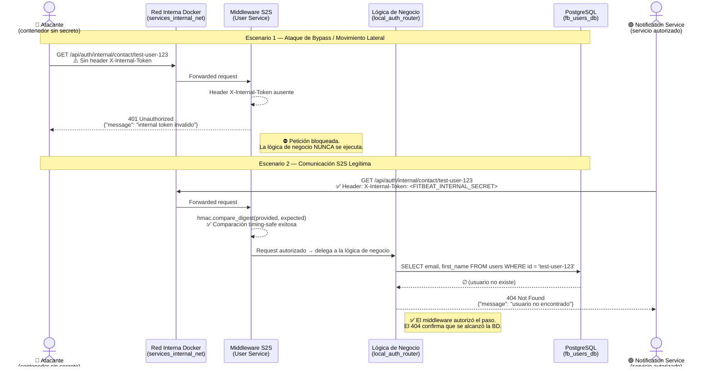

# Patrón de Seguridad: Secret Token (Shared Secret) para Comunicación S2S

## 1. Propósito y Justificación

### 1.1 Definición del Patrón

El patrón **Secret Token** (también denominado *Shared Secret*) es un mecanismo de autenticación Service-to-Service (S2S) en el que todos los microservicios de un ecosistema comparten un secreto criptográfico inyectado en tiempo de despliegue mediante variables de entorno. Cada petición HTTP interna debe incluir dicho secreto en un header estandarizado; los servicios receptores validan su presencia y autenticidad antes de procesar cualquier lógica de negocio.

### 1.2 Amenazas Mitigadas

Este control implementa el principio de **Defensa en Profundidad** (*Defense in Depth*), estableciendo una segunda barrera de autenticación detrás del API Gateway. Su aplicación mitiga directamente los siguientes vectores de ataque:

| Amenaza | Descripción | Mitigación |
|---------|-------------|------------|
| **Bypass del API Gateway** | Un atacante accede directamente a un microservicio sin pasar por Traefik/KrakenD (ej. mediante port scanning o misconfiguration de red). | El middleware rechaza toda petición que carezca del secreto compartido, independientemente de la ruta de acceso. |
| **SSRF (Server-Side Request Forgery)** | Un servicio comprometido o una vulnerabilidad SSRF permite a un atacante forjar peticiones internas hacia endpoints sensibles. | Sin el token correcto, las peticiones forjadas son rechazadas con `401 Unauthorized`. |
| **Movimiento Lateral** | Un contenedor perimetral comprometido intenta escalar privilegios consumiendo APIs internas de otros microservicios. | El secreto no está disponible en contenedores perimetrales (frontends, reverse proxies), limitando el radio de explosión. |

### 1.3 Principio Arquitectónico: Zero Trust Local

En una arquitectura de microservicios, la red interna de Docker (`bridge` networks) **no debe considerarse un perímetro de confianza**. Aunque Fitbeat implementa segmentación de red mediante Docker networks aisladas (`internal: true`), el patrón Shared Secret añade una capa adicional que garantiza: *"ningún servicio es de confianza por defecto, incluso dentro de la red interna"*.

---

## 2. Arquitectura del Control

### 2.1 Flujo de Inyección del Secreto

El secreto se define una única vez en el archivo `.env` raíz del proyecto bajo la variable `FITBEAT_INTERNAL_SECRET` y se propaga a todos los microservicios mediante `docker-compose.yml`:

```
.env (raíz)                    docker-compose.yml                  Contenedor
┌──────────────────┐    ┌─────────────────────────────┐    ┌──────────────────┐
│ FITBEAT_INTERNAL │───▶│ environment:                │───▶│ Variable de      │
│ _SECRET=<valor>  │    │   FITBEAT_INTERNAL_SECRET:  │    │ entorno leída    │
│                  │    │     ${FITBEAT_INTERNAL_..}   │    │ por middleware   │
└──────────────────┘    └─────────────────────────────┘    └──────────────────┘
```

### 2.2 Convenciones del Protocolo

| Elemento | Valor |
|----------|-------|
| **Variable de entorno** | `FITBEAT_INTERNAL_SECRET` |
| **Header HTTP** | `X-Internal-Token` |
| **Comparación** | Timing-safe (tiempo constante) |
| **Respuesta sin token** | `401 Unauthorized` |
| **Respuesta con token inválido** | `401 Unauthorized` / `403 Forbidden` |

### 2.3 Implementación Polígota de Middlewares

Cada microservicio implementa la validación utilizando la función de comparación timing-safe nativa de su lenguaje, mitigando ataques de canal lateral por temporización (*timing attacks*):

| Servicio | Lenguaje | Función de Comparación |
|----------|----------|----------------------|
| User Service | Python | `hmac.compare_digest()` |
| Music Service | Go | `crypto/hmac.Equal()` |
| Achievements Service | C# | `CryptographicOperations.FixedTimeEquals()` |
| Notification Service | Node.js | `crypto.timingSafeEqual()` |
| Event Processor | Java | N/A (worker asíncrono, sin endpoints HTTP) |

### 2.4 Selectividad del Middleware

El middleware **no se aplica a todas las rutas**. Para evitar romper el tráfico legítimo del frontend a través del API Gateway, la validación se activa exclusivamente en rutas con el prefijo `/internal/`:

- ✅ `GET /api/auth/internal/contact/{user_id}` → **Protegido**
- ✅ `GET /auth/internal/token/{user_id}` → **Protegido**
- ❌ `POST /api/auth/login` → **Público** (frontend vía KrakenD)
- ❌ `GET /health` → **Excluido** (healthchecks de Docker)

---

## 3. Diagrama de Secuencia

El siguiente diagrama ilustra los dos escenarios de la Prueba de Concepto: un intento de acceso no autorizado (ataque) y una comunicación S2S legítima.



---

## 4. Prueba de Concepto: Pentesting Local

### 4.1 Modus Operandi

La prueba simula un atacante que ha logrado introducir un contenedor arbitrario dentro de la red interna de Docker (`services_internal_net`), la misma red donde los microservicios se comunican entre sí. Se utiliza la imagen `curlimages/curl` como herramienta de ataque, conectada directamente a la red interna del clúster:

```bash
docker run --rm -it --network prototype_2_services_internal_net curlimages/curl sh
```

Este comando crea un contenedor efímero con acceso directo a la red S2S, simulando el peor escenario: **un atacante dentro del perímetro de red**.

### 4.2 Escenario 1 — Ataque: Acceso Anónimo a Endpoint Interno

**Objetivo**: Verificar que un actor sin credenciales no puede consumir APIs internas.

```bash
curl -i -X GET http://fb_users_ms:8000/api/auth/internal/contact/test-user-123
```

**Resultado obtenido:**

```http
HTTP/1.1 401 Unauthorized
date: Sat, 16 May 2026 21:13:29 GMT
server: uvicorn
content-length: 50
content-type: application/json

{"message":"internal token invalido","details":[]}
```

**Análisis técnico:**

- El middleware del User Service intercepta la petición **antes** de que llegue a la lógica de negocio.
- La ausencia del header `X-Internal-Token` provoca un rechazo inmediato con código `401 Unauthorized`.
- El cuerpo de la respuesta (`content-length: 50`) es mínimo e intencionalmente genérico: no revela información sobre la existencia del endpoint, la estructura de la API ni el usuario solicitado, cumpliendo con el principio de **mínima divulgación de información** (*information leakage prevention*).
- La lógica de negocio y la base de datos **nunca fueron alcanzadas**, eliminando todo riesgo de exfiltración de datos.

### 4.3 Escenario 2 — Comunicación S2S Legítima con Token Válido

**Objetivo**: Verificar que un servicio autorizado con el secreto correcto puede consumir el endpoint interno.

```bash
curl -i -X GET http://fb_users_ms:8000/api/auth/internal/contact/test-user-123 \
  -H "X-Internal-Token: super_secreto_local_123"
```

**Resultado obtenido:**

```http
HTTP/1.1 404 Not Found
date: Sat, 16 May 2026 21:13:39 GMT
server: uvicorn
content-length: 48
content-type: application/json

{"message":"usuario no encontrado","details":[]}
```

**Análisis técnico:**

- El middleware recibe el header `X-Internal-Token` y ejecuta una comparación en tiempo constante (`hmac.compare_digest()`) contra el valor almacenado en la variable de entorno `FITBEAT_INTERNAL_SECRET`.
- La comparación es exitosa → el middleware **autoriza** la petición y la delega al handler `get_user_contact_by_id()`.
- El handler consulta la base de datos PostgreSQL buscando al usuario `test-user-123`, el cual no existe en el entorno de pruebas.
- El código de respuesta `404 Not Found` confirma dos hechos críticos:
  1. **El middleware S2S autorizó la petición correctamente** (de lo contrario habría retornado `401`).
  2. **La lógica de negocio y la base de datos fueron alcanzadas**, demostrando la conectividad completa del flujo autorizado.

### 4.4 Tabla Comparativa de Resultados

| Aspecto | Escenario 1 (Ataque) | Escenario 2 (S2S Legítimo) |
|---------|---------------------|---------------------------|
| **Header X-Internal-Token** | ❌ Ausente | ✅ Presente y válido |
| **Código HTTP** | `401 Unauthorized` | `404 Not Found` |
| **Middleware S2S** | ⛔ Bloquea la petición | ✅ Autoriza la petición |
| **Lógica de negocio alcanzada** | No | Sí |
| **Base de datos consultada** | No | Sí |
| **Datos expuestos** | Ninguno | Ninguno (usuario no existe) |

---

## 5. Evidencia

La siguiente captura de pantalla demuestra la ejecución de ambos escenarios en tiempo real desde un contenedor efímero conectado a la red interna `services_internal_net`. Se observa claramente la diferencia entre la respuesta `401 Unauthorized` (sin token) y la respuesta `404 Not Found` (con token válido):


*Figura 1: Terminal de Git Bash mostrando el pentest local contra el endpoint `/api/auth/internal/contact/` del User Service. Izquierda: petición anónima bloqueada (401). Derecha: petición con token autorizada (404, alcanzó la BD).*

---

## 6. Conclusiones

1. **El patrón Shared Secret está correctamente implementado** y mitiga el acceso no autorizado a endpoints internos S2S, incluso desde contenedores dentro de la red interna de Docker.

2. **La comparación timing-safe** (`hmac.compare_digest`) previene ataques de canal lateral por temporización, asegurando que un atacante no pueda inferir caracteres del secreto midiendo tiempos de respuesta.

3. **La selectividad del middleware** (solo rutas `/internal/`) garantiza que los flujos públicos del frontend a través del API Gateway no se ven afectados, cumpliendo con el requisito de **cero regresiones**.

4. **La segmentación de red + el secret token** conforman dos capas independientes de defensa, alineándose con el principio de *Defense in Depth* recomendado por OWASP y NIST SP 800-204 para arquitecturas de microservicios.
