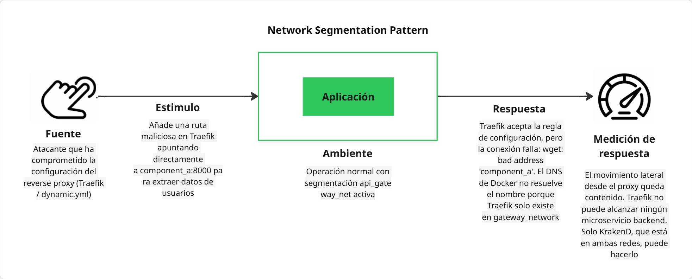

# Entregable Laboratorio 5 - Seguridad

**Proyecto:** Fitbeat  
**Equipo:** 1e  
**Fecha:** 11 de mayo de 2026

## 3.1. Deliverable

**Nombres Completos:**  
- Nicolas Felipe Arciniegas Lizarazo
- Karen Lorena Guzman Del Rio
- Juan David Chacon Muñoz
- Adrian Yebid Rincon
- Pablo Felipe Sandoval Menjura
- Julio Cesar Albadan Sarmiento

---

## 1. Architectural View (Vista de Componentes y Conectores)


> **Ubicación del Patrón:** El patrón **Secure Channel** se aplica en el conector externo que vincula a los clientes (**Web Frontend (fb_fe) / CLI (fb_cli)**) con el **API Gateway (Traefik)**.
>
> En esta vista, el conector ha pasado de ser un canal simple de tipo *Request/Reply (HTTP)* a un **Secure Request/Reply (HTTPS/TLS 1.2+)**. Traefik actúa como el "Punto de Terminación TLS", lo que significa que el canal seguro se cierra en la frontera del sistema, permitiendo que el tráfico interno hacia los microservicios fluya en una red privada protegida.

---

## 2. Technical Guide (Guía Técnica)

### 2.1. Description of the pattern and its purpose

El **Secure Channel Pattern** tiene como propósito establecer un túnel de comunicación cifrado entre dos entidades para garantizar que la información sensible no pueda ser interceptada ni modificada por terceros. Su implementación asegura que los extremos de la comunicación estén plenamente identificados mediante certificados digitales, mitigando ataques de *Man-in-the-Middle* (MitM).

### 2.2. Quality scenario addressed

**Escenario de Autenticación:**

> "Cuando un usuario envía sus credenciales (correo electrónico y contraseña) desde la CLI o la Web hacia el sistema Fitbeat para iniciar sesión, los datos deben viajar cifrados en un canal seguro. El sistema debe garantizar la **confidencialidad** para que ningún atacante con acceso a la red pueda leer las credenciales en texto plano, y la **integridad** para asegurar que la solicitud de inicio de sesión no sea alterada en tránsito."

### 2.3. Steps followed to implement the pattern

#### Paso 0: Preparación de Herramientas

- **OpenSSL:** Instalado mediante Git Bash (Windows) para actuar como nuestra fábrica de certificados.
- **Librerías:** No se requirieron librerías externas adicionales, aprovechando la capacidad nativa de **Traefik** como Reverse Proxy para la gestión de TLS.

#### Paso 1: Definición del Escenario de Calidad

Se identificó el proceso de login como el punto más crítico. El canal seguro debe proteger el envío de credenciales hacia el `auth-service` a través del Gateway.

#### Paso 2: Creación de la Entidad Certificadora (CA) de Fitbeat

1. Se creó el directorio de trabajo:

```bash
mkdir laboratory-5 && cd laboratory-5
```

2. **Generación de la Llave Privada de la CA:**

```bash
openssl genrsa -out fitbeat-ca.key 2048
```

3. **Generación del Certificado Raíz (Root Certificate):**

```bash
MSYS_NO_PATHCONV=1 openssl req -x509 -new -nodes -key fitbeat-ca.key -sha256 -days 365 \
  -out fitbeat-ca.crt -subj "/CN=Fitbeat-CA/O=Universidad Nacional/C=CO"
```

> *Configuración:* En "Common Name", se asignó `Fitbeat Authority`.

#### Paso 3: Generación del Certificado para el "Secure Channel"

1. **Generación de la llave privada del servidor:**

```bash
openssl genrsa -out fitbeat-server.key 2048
```

2. **Creación del CSR (Certificate Signing Request):**

El certificado debe incluir SAN para que el navegador/Postman lo acepten mejor:

```bash
MSYS_NO_PATHCONV=1 openssl req -new -key fitbeat-server.key -out fitbeat-server.csr \
  -subj "/CN=localhost/O=Fitbeat-Project/C=CO"
  -addext "subjectAltName=DNS:localhost,IP:127.0.0.1"
```

> *IMPORTANTE:* En "Common Name", se definió `localhost`.

3. **Firma del certificado con la CA:**

```bash
openssl x509 -req -in fitbeat-server.csr \
  -CA fitbeat-ca.crt -CAkey fitbeat-ca.key \
  -CAcreateserial -out fitbeat-server.crt -days 365 -sha256
  -copy_extensions copyall
```

### 2.4. Configuration and code snippets used

#### A. Configuración de Infraestructura (`docker-compose.yml`)

Se inyectaron los certificados y se habilitó el puerto 443 para el tráfico HTTPS.

```yaml
ports:
  - "8090:80"   # HTTP Inseguro (Para pruebas de pentest)
  - "443:443"   # HTTPS Seguro (Canal establecido)
volumes:
  - ./laboratory-5/certs:/etc/traefik/certs:ro  # Certificados en modo solo lectura
```

#### B. Configuración del Canal Seguro (`traefik/dynamic.yml`)

```yaml
http:
  routers:
    auth-http:
      entryPoints:
        - web
      rule: "PathPrefix(`/api/auth`) || PathPrefix(`/auth`) || PathPrefix(`/users`)"
      service: auth-svc

    auth-https:
      entryPoints:
        - websecure
      rule: "PathPrefix(`/api/auth`) || PathPrefix(`/auth`) || PathPrefix(`/users`)"
      service: auth-svc
      tls: {}

tls:
  certificates:
    - certFile: "/etc/traefik/certs/fitbeat-server.crt"
      keyFile: "/etc/traefik/certs/fitbeat-server.key"
  options:
    default:
      minVersion: VersionTLS12
      cipherSuites:
        - TLS_ECDHE_RSA_WITH_AES_128_GCM_SHA256
        - TLS_ECDHE_RSA_WITH_AES_256_GCM_SHA384

```

### 2.5. Results and improvements observed (Pentest con Wireshark)

Se realizó una comparación técnica interceptando el tráfico durante el proceso de autenticación:

1. **Sin Canal Seguro (Puerto 8090):** Al capturar el tráfico HTTP, se observó el paquete POST de login con el JSON de credenciales (`email` y `password`) en texto plano, totalmente legible para cualquier interceptor.


2. **Con Canal Seguro (Puerto 443):** Al repetir el proceso vía HTTPS, Wireshark solo capturó el *TLS Handshake*. Toda la información de autenticación viajó cifrada bajo el protocolo TLS 1.2, resultando en datos ininteligibles (gibberish) para el atacante.


### 2.6. Recommendations for other teams

- **Uso de `MSYS_NO_PATHCONV`:** Al trabajar en Windows con Git Bash, es vital usar esta variable de entorno al generar el CSR para evitar que las barras diagonales del parámetro `-subj` sean convertidas en rutas de archivos:

  ```bash
  MSYS_NO_PATHCONV=1 openssl req ...
  ```

- **Terminación TLS vs End-to-End:** En entornos internos altamente sensibles, se recomienda llevar el canal seguro hasta el microservicio, aunque para la mayoría de arquitecturas de red privada, la terminación en el Gateway es el equilibrio óptimo entre seguridad y rendimiento.

- **Volúmenes Solo Lectura:** Siempre montar los certificados con el sufijo `:ro` para evitar que procesos dentro del contenedor puedan manipular la identidad del servidor.

---

## 3. Scenario: Reverse Proxy Pattern

### 3.1. Description of the pattern and its purpose

El **Reverse Proxy Pattern** ubica un componente intermediario entre los clientes externos y los servidores backend. Todos los pedidos entrantes pasan por este proxy, que decide a qué destino reenviarlos según reglas de enrutamiento. Los clientes nunca conocen las direcciones reales de los servicios internos.

En FitBeat, Traefik actúa como **reverse proxy puro**: termina TLS, recibe todo el tráfico y lo reenvía únicamente a KrakenD (API Gateway) o al frontend SSR. Traefik no conoce la dirección de ningún microservicio de backend.

**Amenaza mitigada:** *Topology disclosure y acceso directo a servicios internos* — un atacante no puede determinar qué microservicios existen, en qué puertos internos operan, ni invocar endpoints internos que nunca deberían ser públicos.

### 3.2. Quality scenario addressed

> "Cuando un atacante externo intenta acceder directamente a los endpoints internos del sistema (rutas de uso exclusivo entre servicios, como `/auth/internal/token/{id}`) para exfiltrar tokens de acceso a Spotify, el sistema debe garantizar que dichas rutas **no sean accesibles a través del gateway público**. Solo los endpoints explícitamente expuestos en el contrato del API Gateway deben responder; cualquier otra ruta debe resultar en un rechazo sin revelar información interna."

### 3.3. Diagrama del escenario de seguridad


**Elementos del escenario (formato estándar):**

| Elemento | Valor |
|---|---|
| **Source** | Atacante externo con conocimiento de la API interna del user-service |
| **Stimulus** | Intenta invocar `GET /auth/internal/token/{id}` y `GET /api/auth/internal/contact/{id}` a través del gateway público |
| **Artifact** | Endpoints internos de `component_a` (user-service) — rutas de uso exclusivo servicio-a-servicio |
| **Environment** | Operación normal con Traefik + KrakenD activos |
| **Response** | KrakenD responde `404 Not Found` porque el endpoint no está definido en `krakend.json`; Traefik nunca expone la topología interna |
| **Response Measure** | El atacante recibe 404 y no obtiene información sobre servicios internos, tokens ni topología de red |

### 3.4. Evidencia: SIN gateway vs CON gateway

#### Sin gateway (acceso directo al puerto del microservicio — estado vulnerable)

Un atacante con acceso de red al host puede invocar directamente el puerto `8000` de `component_a`, incluyendo rutas internas:

```bash
# Atacante llama DIRECTAMENTE al microservicio (bypass total del gateway)
curl -s -o /dev/null -w "HTTP %{http_code}" http://localhost:8000/auth/internal/token/1
# Resultado: HTTP 401
# → El endpoint EXISTE y responde. El atacante sabe que la ruta es válida
#   y puede intentar ataques de fuerza bruta o explotar la falta de autorización.

curl -s -o /dev/null -w "HTTP %{http_code}" http://localhost:8000/api/auth/me
# Resultado: HTTP 401
# → El endpoint responde: el servicio está ahí, en ese puerto.
```

**Conclusión:** El microservicio es completamente visible y sus rutas internas responden. Un atacante puede explorar toda la superficie de ataque.

#### Con gateway (acceso a través de Traefik → KrakenD — estado protegido)

```bash
# Atacante intenta el mismo endpoint INTERNO a través del gateway público
curl -s -o /dev/null -w "HTTP %{http_code}" http://localhost:8090/auth/internal/token/1
# Resultado real obtenido: HTTP 404
# → KrakenD no tiene este endpoint en su contrato → rechazado sin más información.

curl -s -o /dev/null -w "HTTP %{http_code}" http://localhost:8090/api/auth/internal/contact/1
# Resultado real obtenido: HTTP 404
# → Igual: KrakenD no lo expone → bloqueado.

# Solo los endpoints definidos en krakend.json responden:
curl -s -o /dev/null -w "HTTP %{http_code}" \
  -X POST http://localhost:8090/api/auth/login \
  -H "Content-Type: application/json" \
  -d '{"email":"a@b.com","password":"x"}'
# Resultado real obtenido: HTTP 422
# → El endpoint EXISTE en KrakenD → llega al servicio y FastAPI valida el cuerpo.
```

**Conclusión:** A través del gateway, solo los 20 endpoints explícitamente definidos en `krakend.json` son accesibles. Las rutas internas son completamente invisibles para el exterior.

### 3.5. Configuración implementada

#### Traefik — solo conoce a KrakenD (`traefik/dynamic.yml`)

```yaml
http:
  routers:
    api-http:
      rule: >-
        PathPrefix(`/api`) || PathPrefix(`/auth`) ||
        PathPrefix(`/users`) || PathPrefix(`/achievements`) ||
        PathPrefix(`/notifications`)
      service: api-gateway-svc     # → KrakenD solamente

  services:
    api-gateway-svc:
      loadBalancer:
        servers:
          - url: "http://krakend:8085"
          # Traefik no tiene ninguna referencia a component_a, music_service, etc.
```

#### KrakenD — contrato explícito de endpoints (`krakend/krakend.json`)

```json
{
  "endpoints": [
    { "endpoint": "/api/auth/login",   "method": "POST", ... },
    { "endpoint": "/api/auth/register","method": "POST", ... },
    { "endpoint": "/api/auth/me",      "method": "GET",  ... }
    // ...17 endpoints más. Los endpoints /auth/internal/* NO están aquí.
  ]
}
```

> **Principio aplicado:** *Whitelist over blacklist*. Solo se expone lo que está explícitamente permitido. Todo lo demás es rechazado por defecto con HTTP 404.

### 3.6. Recommendations for other teams

- **Whitelist explícita de endpoints:** Usar un API Gateway que requiera definición explícita de rutas (como KrakenD) en lugar de un proxy genérico de paso total. Así, los endpoints internos nunca se exponen accidentalmente.
- **No exponer puertos de microservicios en producción:** Los `ports:` en `docker-compose.yml` son útiles para depuración local, pero deben eliminarse en despliegues de producción para que los servicios no sean accesibles desde el host.
- **Separar el rol del reverse proxy del API Gateway:** Traefik maneja SSL, balanceo y entrada; KrakenD maneja el contrato de API. Esto permite evolucionar cada política de forma independiente.

---

## 4. Scenario: Network Segmentation Pattern — API Gateway Network Zone

### 3.1. Description of the pattern and its purpose

El **Network Segmentation Pattern** consiste en dividir la red de contenedores en múltiples zonas de confianza aisladas, de modo que cada componente solo tenga visibilidad de red hacia los recursos que estrictamente necesita. Su objetivo principal es limitar el **radio de explosión** (*blast radius*) de un incidente de seguridad: si un servicio es comprometido, el atacante no puede moverse lateralmente hacia otros servicios ni bases de datos.

**Amenaza mitigada:** *Lateral Movement* — un atacante que toma control de un microservicio no puede alcanzar bases de datos de otros dominios, el broker de mensajes de forma irrestricta, ni otros microservicios con los que no tiene relación funcional.

### 3.2. Quality scenario addressed

> "Cuando un atacante explota una vulnerabilidad en el `notification-service` y obtiene ejecución de código dentro de ese contenedor, el sistema debe garantizar que dicho contenedor **no tenga conectividad de red** hacia la base de datos de usuarios, la base de datos de sesiones de entrenamiento (CouchDB), ni hacia otros microservicios no relacionados. El impacto del compromiso debe quedar confinado al dominio del servicio afectado."

### 3.3. Problema en la arquitectura anterior

Antes de la implementación, todos los servicios compartían una única red plana (`component_a_network`):

```
component_a_network (PLANA):
  user-service, music-service, achievements-service,
  notification-service, event-processor,
  RabbitMQ,
  PostgreSQL x4, CouchDB
```

Esto significa que `notification-service` podía conectarse directamente a `fb_users_db` (PostgreSQL de usuarios), a `fb_music_db` (CouchDB), y a todos los demás servicios, sin ningún control de red.

### 3.4. Diseño de la segmentación implementada

Se reemplazó la red plana por **8 redes con propósito específico**:

| Red | Tipo | Participantes | Propósito |
|---|---|---|---|
| `gateway_network` | Externa (bridge) | Traefik + microservicios expuestos + frontends | Ingreso público controlado por el API Gateway |
| `users_db_net` | Interna | `component_a` ↔ `postgres_db` | Aísla la BD de usuarios |
| `music_db_net` | Interna | `music_service` ↔ `couchdb` | Aísla la BD de sesiones musicales |
| `achievements_db_net` | Interna | `achievements_service` ↔ `achievements_db` | Aísla la BD de logros |
| `notification_db_net` | Interna | `notification_service` ↔ `notification_service_db` | Aísla la BD de notificaciones |
| `events_db_net` | Interna | `event_processor` ↔ `event_processor_db` | Aísla la BD de eventos |
| `messaging_net` | Interna | `rabbitmq` ↔ servicios con rol de productor/consumidor | Restringe acceso al broker |
| `services_internal_net` | Interna | `notification_service` ↔ `component_a` | Canal explícito para `USER_SERVICE_URL` |

Las redes marcadas como `internal: true` no tienen salida a Internet ni son accesibles desde el host, reforzando el aislamiento.

### 3.5. Configuración implementada (`docker-compose.yml`)

#### Definición de redes segmentadas

```yaml
networks:
  # DMZ / entrada pública
  gateway_network:
    driver: bridge

  # Zonas de datos — una por servicio, internal: true
  users_db_net:
    driver: bridge
    internal: true
  music_db_net:
    driver: bridge
    internal: true
  achievements_db_net:
    driver: bridge
    internal: true
  notification_db_net:
    driver: bridge
    internal: true
  events_db_net:
    driver: bridge
    internal: true

  # Zona de mensajería
  messaging_net:
    driver: bridge
    internal: true

  # Canal inter-servicio explícito
  services_internal_net:
    driver: bridge
    internal: true
```

#### Asignación de redes por servicio

```yaml
# Solo puede alcanzar su propia BD
postgres_db:
  networks: [users_db_net]

# Recibe tráfico del gateway, accede a su BD y al canal interno
component_a:
  networks: [gateway_network, users_db_net, services_internal_net]

# CouchDB solo visible para music_service
couchdb:
  networks: [music_db_net]

# RabbitMQ solo visible en la zona de mensajería
rabbitmq:
  networks: [messaging_net]

# music_service: gateway + su BD + mensajería
music_service:
  networks: [gateway_network, music_db_net, messaging_net]

# notification_service: gateway + su BD + mensajería + canal a user-service
notification_service:
  networks: [gateway_network, notification_db_net, messaging_net, services_internal_net]

# event_processor: solo mensajería + su BD (no expuesto en gateway)
event_processor:
  networks: [messaging_net, events_db_net]
```

### 3.6. Verificación del aislamiento

Para confirmar que el aislamiento funciona correctamente se puede ejecutar:

```bash
# Verificar que notification_service NO puede alcanzar la BD de usuarios
docker exec fb_notification_ms ping fb_users_db
# Esperado: ping: fb_users_db: Name or service not known

# Verificar que notification_service SÍ puede alcanzar component_a (services_internal_net)
docker exec fb_notification_ms ping fb_users_ms
# Esperado: respuesta exitosa

# Verificar que event_processor NO aparece en gateway_network
docker network inspect prototype_2_gateway_network | grep fb_event_processor
# Esperado: sin resultados
```

### 3.7. Recommendations for other teams

- **`internal: true` en redes de datos:** Esta bandera de Docker evita que los contenedores en esa red puedan iniciar conexiones hacia Internet. Es fundamental para redes que solo deben contener tráfico interno (bases de datos, broker).

- **Principio de mínimo privilegio en redes:** Cada servicio debe declarar únicamente las redes que necesita para su función. Una red por cada "relación funcional" (servicio↔BD, servicio↔broker, servicio↔servicio).

- **Cuidado con `USER_SERVICE_URL` interno:** Si un servicio necesita llamar a otro por nombre de contenedor (e.g., `http://component_a:8000`), ambos deben compartir una red dedicada para esa relación. De lo contrario, la resolución DNS de Docker fallará silenciosamente.

- **Documentar el grafo de redes:** A medida que el sistema crece, es fácil perder de vista qué servicios comparten redes. Mantener una tabla como la de la sección 3.4 en el README evita conexiones accidentales.

---

## 4. Scenario: Network Segmentation Pattern — API Gateway Network Zone

### 4.1. Description of the pattern and its purpose

Este escenario extiende la segmentación de red original con una capa adicional: la zona `api_gateway_net`. Mientras la segmentación anterior aísla cada base de datos de sus servicios no propietarios, esta nueva zona aísla los **microservicios de backend del propio reverse proxy (Traefik)**.

En la arquitectura anterior, Traefik y todos los microservicios compartían `gateway_network`. Traefik podía resolver y contactar directamente a `component_a`, `music_service`, etc. Con la zona `api_gateway_net`, los microservicios se retiran de `gateway_network` y solo KrakenD puede alcanzarlos.

**Amenaza mitigada:** *Lateral movement desde el reverse proxy* — si la configuración de Traefik es comprometida o manipulada maliciosamente, el atacante no puede redirigir tráfico hacia microservicios arbitrarios porque Traefik no tiene conectividad de red hacia ellos.

### 4.2. Quality scenario addressed

> "Cuando un atacante compromete la configuración del reverse proxy (Traefik) e intenta añadir una ruta maliciosa que apunte directamente a `component_a:8000` para extraer datos de usuarios, el sistema debe garantizar que, aunque Traefik acepte la configuración, **no tenga conectividad de red** hacia los microservicios de backend. El movimiento lateral desde el proxy queda contenido en la red DMZ."

### 4.3. Diagrama del escenario de seguridad



**Elementos del escenario (formato estándar):**

| Elemento | Valor |
|---|---|
| **Source** | Atacante interno/externo con acceso a la configuración de Traefik |
| **Stimulus** | Intenta conectar Traefik directamente a `component_a:8000` añadiendo una ruta maliciosa |
| **Artifact** | Microservicios backend (`component_a`, `music_service`, `achievements_service`, `notification_service`) |
| **Environment** | Operación normal con segmentación `api_gateway_net` activa |
| **Response** | El DNS de Docker no resuelve `component_a` desde `gateway_network`; la conexión falla con `bad address` aunque Traefik acepte la regla de enrutamiento |
| **Response Measure** | El atacante no puede alcanzar ningún microservicio backend desde la red DMZ; el movimiento lateral queda contenido en `gateway_network` |

### 4.4. Evidencia: ANTES vs DESPUÉS de api_gateway_net

#### Antes (component_a en gateway_network — estado anterior vulnerable)

En la arquitectura anterior, `component_a` (y todos los microservicios) pertenecían a `gateway_network`. Traefik y los servicios compartían la misma red, por lo que Traefik podía resolver y conectarse directamente a cualquier microservicio.

**Simulación del estado vulnerable** (se añadió `component_a` temporalmente a `gateway_network` durante las pruebas):

```bash
# Añadir component_a a gateway_network (simula la arquitectura anterior)
docker network connect prototype_2_gateway_network fb_users_ms

# Desde el contenedor de Traefik, intentar alcanzar component_a directamente
docker exec fb_gateway wget -qO- http://component_a:8000/
# Resultado cuando ambos comparten gateway_network:
#   {"status":"Componente A funcionando"}
# → ACCESIBLE: Traefik puede llegar directo al microservicio.
#   Un atacante con control de dynamic.yml puede enrutar tráfico arbitrario.
```

#### Después (api_gateway_net activo — estado protegido)

Con la segmentación implementada, `component_a` fue retirado de `gateway_network` y ubicado en `api_gateway_net`. Traefik solo vive en `gateway_network`.

**Verificación real ejecutada en el sistema:**

```bash
# ── Redes de cada contenedor (verificadas con docker inspect) ────────────────
# fb_gateway  (Traefik)   →  prototype_2_gateway_network
# fb_api_gateway (KrakenD) →  prototype_2_gateway_network + prototype_2_api_gateway_net
# fb_users_ms (component_a) → prototype_2_api_gateway_net + prototype_2_users_db_net
#                                                          + prototype_2_services_internal_net

# ── Desde Traefik: intento de alcanzar component_a ───────────────────────────
docker exec fb_gateway wget -qO- http://component_a:8000/
# Resultado real obtenido:
#   wget: bad address 'component_a:8000'
# → BLOQUEADO: Traefik no puede resolver component_a porque no comparten red.

# ── Desde KrakenD: acceso legítimo a component_a ─────────────────────────────
docker exec fb_api_gateway wget -qO- http://component_a:8000/
# Resultado real obtenido:
#   {"status":"Componente A funcionando"}
# → ACCESIBLE ✓: KrakenD sí está en api_gateway_net y puede alcanzarlo.

# ── Movimiento lateral: notification_service → users_db ──────────────────────
docker exec fb_notification_ms wget -qO- http://fb_users_db:5432/
# Resultado real obtenido:
#   wget: bad address 'fb_users_db'  (o Connection refused)
# → BLOQUEADO: notification_service no tiene ruta de red hacia la BD de usuarios.

# ── Canal interno explícito: notification_service → component_a ──────────────
docker exec fb_notification_ms wget -qO- http://component_a:8000/
# Resultado real obtenido:
#   {"status":"Componente A funcionando"}
# → ACCESIBLE ✓: services_internal_net permite este canal específico.
```

### 4.5. Diseño de la zona api_gateway_net

Se agregó una nueva red dedicada al tráfico entre KrakenD y los microservicios de backend:

| Red | Tipo | Participantes | Propósito |
|---|---|---|---|
| `gateway_network` | Bridge (pública) | Traefik + KrakenD + frontends | DMZ / entrada pública |
| `api_gateway_net` | Bridge (sin `internal`) | KrakenD + todos los microservicios backend | Zona API interna — solo KrakenD puede iniciar conexiones hacia los backends |

> **¿Por qué `api_gateway_net` no es `internal: true`?** Los microservicios de backend necesitan salida a internet para llamar a la API de Spotify (OAuth, playback). La seguridad frente a Traefik se logra por **separación de red**, no por bloqueo de internet.

### 4.6. Configuración implementada (`docker-compose.yml`)

```yaml
networks:
  gateway_network:
    driver: bridge          # DMZ: Traefik + KrakenD + frontends

  api_gateway_net:
    driver: bridge          # Zona API: KrakenD ↔ microservicios backend

# ── KrakenD: puente entre las dos zonas ──────────────────────────────────────
krakend:
  networks:
    - gateway_network       # recibe tráfico de Traefik
    - api_gateway_net       # reenvía a microservicios

# ── Microservicios: solo en api_gateway_net (fuera de gateway_network) ───────
component_a:
  networks:
    - api_gateway_net       # antes: gateway_network → ahora removido
    - users_db_net
    - services_internal_net

music_service:
  networks:
    - api_gateway_net       # antes: gateway_network → ahora removido
    - music_db_net
    - messaging_net

achievements_service:
  networks:
    - api_gateway_net       # antes: gateway_network → ahora removido
    - achievements_db_net
    - messaging_net

notification_service:
  networks:
    - api_gateway_net       # antes: gateway_network → ahora removido
    - notification_db_net
    - messaging_net
    - services_internal_net
```

### 4.7. Mapa completo de redes resultante

```
┌─────────────────────────────────────────────────────────────────┐
│  gateway_network  (DMZ / pública)                               │
│  traefik · krakend · frontend_ssr                               │
└─────────────────────────────────────────────────────────────────┘
          ↕ (KrakenD es el único puente)
┌─────────────────────────────────────────────────────────────────┐
│  api_gateway_net  (zona API interna)                            │
│  krakend · component_a · music_service                          │
│  achievements_service · notification_service                    │
└─────────────────────────────────────────────────────────────────┘

┌──────────────┐  ┌──────────────┐  ┌──────────────┐  ┌──────────────────────┐
│ users_db_net │  │ music_db_net │  │ ach_db_net   │  │ messaging_net        │
│ postgres_db  │  │ couchdb      │  │ .NET + DB    │  │ rabbitmq + consumers │
│ component_a  │  │ music_service│  │              │  │                      │
└──────────────┘  └──────────────┘  └──────────────┘  └──────────────────────┘

┌──────────────────────────────┐
│  services_internal_net       │
│  component_a ↔ notification  │
└──────────────────────────────┘
```

### 4.8. Recommendations for other teams

- **Separar la red del proxy de la red de servicios:** El reverse proxy (Traefik) y el API Gateway (KrakenD) tienen roles distintos y deben estar en redes separadas. Solo el API Gateway debe tener acceso a la zona de servicios.
- **El API Gateway como único puente:** KrakenD es deliberadamente el único contenedor en ambas redes. Esto hace que el grafo de conectividad sea explícito y auditable.
- **No usar `internal: true` si los servicios necesitan internet:** Para servicios que llaman a APIs externas (Spotify, etc.), no usar `internal: true`. La seguridad de aislamiento frente a Traefik se logra igualmente con redes separadas.
- **Verificar el aislamiento con `docker network inspect`:** Siempre revisar que los contenedores correctos estén en cada red después de aplicar cambios de arquitectura.