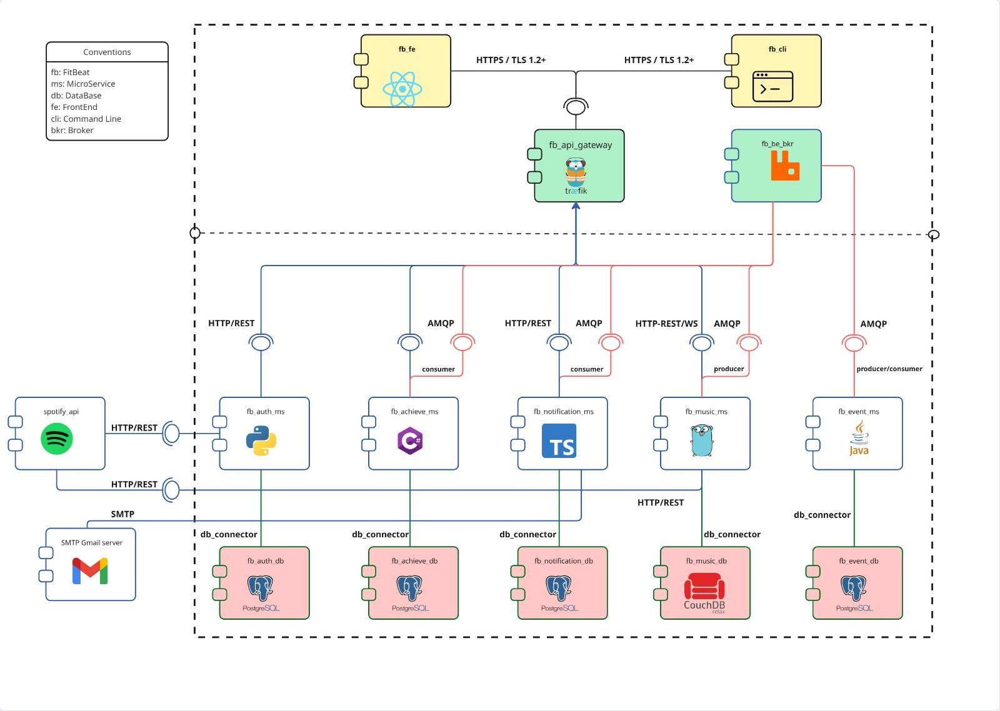
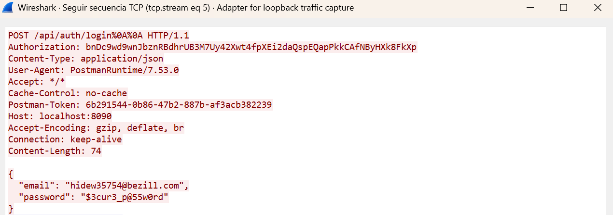
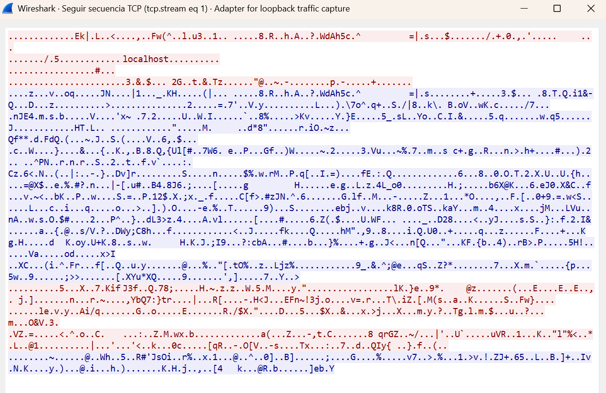
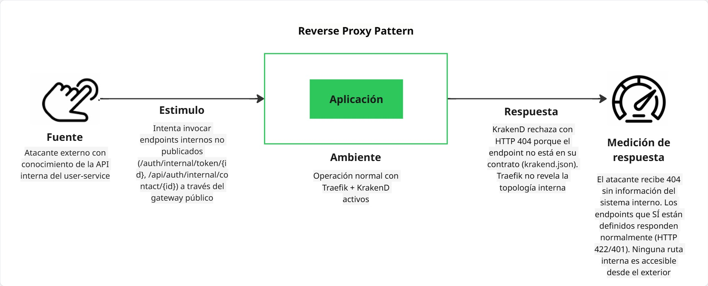
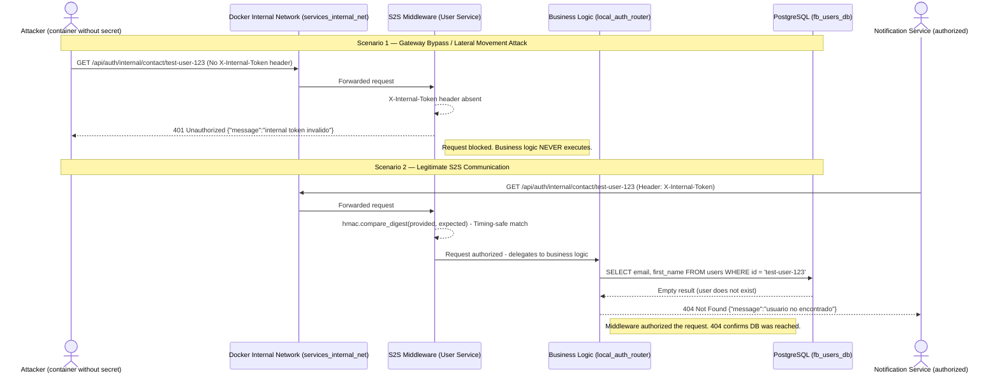

# Laboratory 5 Deliverable — Security

**Project:** Fitbeat
**Team:** 1e
**Date:** May 11, 2026

## 3.1. Deliverable

**Full Names:**
- Nicolas Felipe Arciniegas Lizarazo
- Karen Lorena Guzman Del Rio
- Juan David Chacon Muñoz
- Adrian Yebid Rincon
- Pablo Felipe Sandoval Menjura
- Julio Cesar Albadan Sarmiento

---

## 1. Architectural View (Component and Connector View)



> **Pattern Location:** The **Secure Channel** pattern is applied to the external connector linking clients (**Web Frontend (fb_fe) / CLI (fb_cli)**) with the **API Gateway (Traefik)**.
>
> In this view, the connector has evolved from a simple *Request/Reply (HTTP)* channel to a **Secure Request/Reply (HTTPS/TLS 1.2+)**. Traefik acts as the "TLS Termination Point", meaning the secure channel is closed at the system boundary, allowing internal traffic toward microservices to flow over a protected private network.

---

## 2. Technical Guide — Secure Channel Pattern

### 2.1. Description of the Pattern and Its Purpose

The **Secure Channel Pattern** establishes an encrypted communication tunnel between two entities to ensure that sensitive information cannot be intercepted or modified by third parties. Its implementation guarantees that communication endpoints are fully identified through digital certificates, mitigating *Man-in-the-Middle* (MitM) attacks.

### 2.2. Quality Scenario Addressed

**Authentication Scenario:**

> "When a user sends their credentials (email and password) from the CLI or the Web to the Fitbeat system to log in, the data must travel encrypted through a secure channel. The system must guarantee **confidentiality** so that no attacker with network access can read credentials in plain text, and **integrity** to ensure the login request is not altered in transit."

### 2.3. Steps Followed to Implement the Pattern

#### Step 0: Tool Preparation

- **OpenSSL:** Installed via Git Bash (Windows) to act as our certificate factory.
- **Libraries:** No additional external libraries were required, leveraging the native TLS management capabilities of **Traefik** as a Reverse Proxy.

#### Step 1: Quality Scenario Definition

The login process was identified as the most critical point. The secure channel must protect the transmission of credentials to the `auth-service` through the Gateway.

#### Step 2: Creation of the Fitbeat Certificate Authority (CA)

1. The working directory was created:

```bash
mkdir laboratory-5 && cd laboratory-5
```

2. **CA Private Key Generation:**

```bash
openssl genrsa -out fitbeat-ca.key 2048
```

3. **Root Certificate Generation:**

```bash
MSYS_NO_PATHCONV=1 openssl req -x509 -new -nodes -key fitbeat-ca.key -sha256 -days 365 \
  -out fitbeat-ca.crt -subj "/CN=Fitbeat-CA/O=Universidad Nacional/C=CO"
```

> *Configuration:* The "Common Name" was set to `Fitbeat Authority`.

#### Step 3: Server Certificate Generation for the Secure Channel

1. **Server private key generation:**

```bash
openssl genrsa -out fitbeat-server.key 2048
```

2. **CSR (Certificate Signing Request) creation:**

The certificate must include SAN for browser/Postman acceptance:

```bash
MSYS_NO_PATHCONV=1 openssl req -new -key fitbeat-server.key -out fitbeat-server.csr \
  -subj "/CN=localhost/O=Fitbeat-Project/C=CO"
  -addext "subjectAltName=DNS:localhost,IP:127.0.0.1"
```

> *IMPORTANT:* The "Common Name" was set to `localhost`.

3. **Certificate signing with the CA:**

```bash
openssl x509 -req -in fitbeat-server.csr \
  -CA fitbeat-ca.crt -CAkey fitbeat-ca.key \
  -CAcreateserial -out fitbeat-server.crt -days 365 -sha256
  -copy_extensions copyall
```

### 2.4. Configuration and Code Snippets Used

#### A. Infrastructure Configuration (`docker-compose.yml`)

Certificates were injected and port 443 was enabled for HTTPS traffic.

```yaml
ports:
  - "8090:80"   # Insecure HTTP (for pentest scenarios)
  - "443:443"   # Secure HTTPS (established channel)
volumes:
  - ./laboratory-5/certs:/etc/traefik/certs:ro  # Certificates in read-only mode
```

#### B. Secure Channel Configuration (`traefik/dynamic.yml`)

```yaml
http:
  routers:
    auth-http:
      entryPoints:
        - web
      rule: "PathPrefix(`/api/auth`) || PathPrefix(`/auth`) || PathPrefix(`/users`)"
      service: auth-svc

    auth-https:
      entryPoints:
        - websecure
      rule: "PathPrefix(`/api/auth`) || PathPrefix(`/auth`) || PathPrefix(`/users`)"
      service: auth-svc
      tls: {}

tls:
  certificates:
    - certFile: "/etc/traefik/certs/fitbeat-server.crt"
      keyFile: "/etc/traefik/certs/fitbeat-server.key"
  options:
    default:
      minVersion: VersionTLS12
      cipherSuites:
        - TLS_ECDHE_RSA_WITH_AES_128_GCM_SHA256
        - TLS_ECDHE_RSA_WITH_AES_256_GCM_SHA384
```

### 2.5. Results and Improvements Observed (Pentest with Wireshark)

A technical comparison was performed by intercepting traffic during the authentication process:

1. **Without Secure Channel (Port 8090):** When capturing HTTP traffic, the POST login packet was observed with the JSON credentials (`email` and `password`) in plain text, fully readable by any interceptor.



2. **With Secure Channel (Port 443):** When repeating the process via HTTPS, Wireshark only captured the *TLS Handshake*. All authentication information traveled encrypted under the TLS 1.2 protocol, resulting in unintelligible data (gibberish) for the attacker.



### 2.6. Recommendations for Other Teams

- **Use of `MSYS_NO_PATHCONV`:** When working on Windows with Git Bash, it is vital to use this environment variable when generating the CSR to prevent forward slashes in the `-subj` parameter from being converted into file paths:

  ```bash
  MSYS_NO_PATHCONV=1 openssl req ...
  ```

- **TLS Termination vs End-to-End:** In highly sensitive internal environments, it is recommended to carry the secure channel all the way to the microservice, although for most private network architectures, termination at the Gateway is the optimal balance between security and performance.

- **Read-Only Volumes:** Always mount certificates with the `:ro` suffix to prevent processes inside the container from manipulating the server's identity.

---

## 3. Technical Guide — Reverse Proxy Pattern

### 3.1. Description of the Pattern and Its Purpose

The **Reverse Proxy Pattern** places an intermediary component between external clients and backend servers. All incoming requests pass through this proxy, which decides where to forward them based on routing rules. Clients never know the real addresses of internal services.

In FitBeat, Traefik acts as a **pure reverse proxy**: it terminates TLS, receives all traffic, and forwards it exclusively to KrakenD (API Gateway) or the SSR frontend. Traefik does not know the address of any backend microservice.

**Threat mitigated:** *Topology disclosure and direct access to internal services* — an attacker cannot determine which microservices exist, on which internal ports they operate, nor invoke internal endpoints that should never be public.

### 3.2. Quality Scenario Addressed

> "When an external attacker attempts to directly access internal system endpoints (routes for exclusive inter-service use, such as `/auth/internal/token/{id}`) to exfiltrate Spotify access tokens, the system must guarantee that such routes **are not accessible through the public gateway**. Only endpoints explicitly exposed in the API Gateway contract should respond; any other route must result in a rejection without revealing internal information."

### 3.3. Security Scenario Diagram



**Scenario elements (standard format):**

| Element | Value |
|---|---|
| **Source** | External attacker with knowledge of the user-service internal API |
| **Stimulus** | Attempts to invoke `GET /auth/internal/token/{id}` and `GET /api/auth/internal/contact/{id}` through the public gateway |
| **Artifact** | Internal endpoints of `component_a` (user-service) — routes for exclusive service-to-service use |
| **Environment** | Normal operation with Traefik + KrakenD active |
| **Response** | KrakenD responds `404 Not Found` because the endpoint is not defined in `krakend.json`; Traefik never exposes internal topology |
| **Response Measure** | The attacker receives 404 and obtains no information about internal services, tokens, or network topology |

### 3.4. Evidence: WITHOUT Gateway vs WITH Gateway

#### Without gateway (direct access to microservice port — vulnerable state)

An attacker with network access to the host can directly invoke port `8000` of `component_a`, including internal routes:

```bash
# Attacker calls DIRECTLY to the microservice (total gateway bypass)
curl -s -o /dev/null -w "HTTP %{http_code}" http://localhost:8000/auth/internal/token/1
# Result: HTTP 401
# → The endpoint EXISTS and responds. The attacker knows the route is valid
#   and can attempt brute-force attacks or exploit lack of authorization.

curl -s -o /dev/null -w "HTTP %{http_code}" http://localhost:8000/api/auth/me
# Result: HTTP 401
# → The endpoint responds: the service is there, on that port.
```

**Conclusion:** The microservice is fully visible and its internal routes respond. An attacker can explore the entire attack surface.

#### With gateway (access through Traefik → KrakenD — protected state)

```bash
# Attacker attempts the same INTERNAL endpoint through the public gateway
curl -s -o /dev/null -w "HTTP %{http_code}" http://localhost:8090/auth/internal/token/1
# Actual result obtained: HTTP 404
# → KrakenD does not have this endpoint in its contract → rejected without further info.

curl -s -o /dev/null -w "HTTP %{http_code}" http://localhost:8090/api/auth/internal/contact/1
# Actual result obtained: HTTP 404
# → Same: KrakenD does not expose it → blocked.

# Only endpoints defined in krakend.json respond:
curl -s -o /dev/null -w "HTTP %{http_code}" \
  -X POST http://localhost:8090/api/auth/login \
  -H "Content-Type: application/json" \
  -d '{"email":"a@b.com","password":"x"}'
# Actual result obtained: HTTP 422
# → The endpoint EXISTS in KrakenD → reaches the service and FastAPI validates the body.
```

**Conclusion:** Through the gateway, only the 20 endpoints explicitly defined in `krakend.json` are accessible. Internal routes are completely invisible to the outside.

### 3.5. Configuration Implemented

#### Traefik — only knows KrakenD (`traefik/dynamic.yml`)

```yaml
http:
  routers:
    api-http:
      rule: >-
        PathPrefix(`/api`) || PathPrefix(`/auth`) ||
        PathPrefix(`/users`) || PathPrefix(`/achievements`) ||
        PathPrefix(`/notifications`)
      service: api-gateway-svc     # → KrakenD only

  services:
    api-gateway-svc:
      loadBalancer:
        servers:
          - url: "http://krakend:8085"
          # Traefik has no reference to component_a, music_service, etc.
```

#### KrakenD — explicit endpoint contract (`krakend/krakend.json`)

```json
{
  "endpoints": [
    { "endpoint": "/api/auth/login",   "method": "POST", "..." : "..." },
    { "endpoint": "/api/auth/register","method": "POST", "..." : "..." },
    { "endpoint": "/api/auth/me",      "method": "GET",  "..." : "..." }
    // ...17 more endpoints. The /auth/internal/* endpoints are NOT here.
  ]
}
```

> **Principle applied:** *Whitelist over blacklist*. Only what is explicitly permitted is exposed. Everything else is rejected by default with HTTP 404.

### 3.6. Recommendations for Other Teams

- **Explicit endpoint whitelist:** Use an API Gateway that requires explicit route definition (like KrakenD) instead of a generic pass-through proxy. This way, internal endpoints are never accidentally exposed.
- **Do not expose microservice ports in production:** The `ports:` entries in `docker-compose.yml` are useful for local debugging but must be removed in production deployments so services are not accessible from the host.
- **Separate the reverse proxy role from the API Gateway:** Traefik handles SSL, load balancing, and ingress; KrakenD handles the API contract. This allows each policy to evolve independently.

---

## 4. Technical Guide — Network Segmentation Pattern

### 4.1. Description of the Pattern and Its Purpose

The **Network Segmentation Pattern** consists of dividing the container network into multiple isolated trust zones, so that each component only has network visibility to the resources it strictly needs. Its primary objective is to limit the **blast radius** of a security incident: if a service is compromised, the attacker cannot move laterally toward other services or databases.

**Threat mitigated:** *Lateral Movement* — an attacker who takes control of a microservice cannot reach databases of other domains, the message broker without restriction, nor other microservices with which it has no functional relationship.

### 4.2. Quality Scenario Addressed

> "When an attacker exploits a vulnerability in the `notification-service` and gains code execution inside that container, the system must guarantee that said container **has no network connectivity** toward the user database, the training session database (CouchDB), nor toward other unrelated microservices. The impact of the compromise must remain confined to the affected service's domain."

### 4.3. Problem in the Previous Architecture

Before implementation, all services shared a single flat network (`component_a_network`):

```
component_a_network (FLAT):
  user-service, music-service, achievements-service,
  notification-service, event-processor,
  RabbitMQ,
  PostgreSQL x4, CouchDB
```

This meant `notification-service` could connect directly to `fb_users_db` (users PostgreSQL), `fb_music_db` (CouchDB), and all other services without any network control.

### 4.4. Segmentation Design Implemented

The flat network was replaced by **8 purpose-specific networks**:

| Network | Type | Participants | Purpose |
|---|---|---|---|
| `gateway_network` | External (bridge) | Traefik + KrakenD + frontends | Public ingress controlled by API Gateway |
| `api_gateway_net` | Bridge (no `internal`) | KrakenD + all backend microservices | Internal API zone — only KrakenD can initiate connections to backends |
| `users_db_net` | Internal | `component_a` ↔ `postgres_db` | Isolates the user database |
| `music_db_net` | Internal | `music_service` ↔ `couchdb` | Isolates the music session database |
| `achievements_db_net` | Internal | `achievements_service` ↔ `achievements_db` | Isolates the achievements database |
| `notification_db_net` | Internal | `notification_service` ↔ `notification_service_db` | Isolates the notification database |
| `events_db_net` | Internal | `event_processor` ↔ `event_processor_db` | Isolates the event database |
| `messaging_net` | Internal | `rabbitmq` ↔ producer/consumer services | Restricts broker access |
| `services_internal_net` | Internal | `notification_service` ↔ `component_a` | Explicit channel for `USER_SERVICE_URL` |

Networks marked as `internal: true` have no Internet egress and are not accessible from the host, reinforcing isolation.

### 4.5. Configuration Implemented (`docker-compose.yml`)

#### Segmented network definitions

```yaml
networks:
  # DMZ / public entrance
  gateway_network:
    driver: bridge

  # API zone: KrakenD ↔ backend microservices
  api_gateway_net:
    driver: bridge

  # Data zones — one per service, internal: true
  users_db_net:
    driver: bridge
    internal: true
  music_db_net:
    driver: bridge
    internal: true
  achievements_db_net:
    driver: bridge
    internal: true
  notification_db_net:
    driver: bridge
    internal: true
  events_db_net:
    driver: bridge
    internal: true

  # Messaging zone
  messaging_net:
    driver: bridge
    internal: true

  # Explicit inter-service channel
  services_internal_net:
    driver: bridge
    internal: true
```

#### Network assignment per service

```yaml
# Can only reach its own database
postgres_db:
  networks: [users_db_net]

# Receives gateway traffic, accesses its DB and internal channel
component_a:
  networks: [api_gateway_net, users_db_net, services_internal_net]

# CouchDB only visible to music_service
couchdb:
  networks: [music_db_net]

# RabbitMQ only visible in the messaging zone
rabbitmq:
  networks: [messaging_net]

# music_service: API gateway + its DB + messaging
music_service:
  networks: [api_gateway_net, music_db_net, messaging_net]

# notification_service: API gateway + its DB + messaging + channel to user-service
notification_service:
  networks: [api_gateway_net, notification_db_net, messaging_net, services_internal_net]

# event_processor: messaging + its DB only (not exposed on gateway)
event_processor:
  networks: [messaging_net, events_db_net]

# KrakenD: bridge between the two zones
krakend:
  networks:
    - gateway_network       # receives traffic from Traefik
    - api_gateway_net       # forwards to microservices
```

### 4.6. API Gateway Network Zone (`api_gateway_net`)

This scenario extends the original network segmentation with an additional layer: the `api_gateway_net` zone. While the previous segmentation isolates each database from non-owner services, this new zone isolates **backend microservices from the reverse proxy (Traefik) itself**.

In the previous architecture, Traefik and all microservices shared `gateway_network`. Traefik could resolve and contact `component_a`, `music_service`, etc. directly. With `api_gateway_net`, microservices are removed from `gateway_network` and only KrakenD can reach them.

**Threat mitigated:** *Lateral movement from the reverse proxy* — if Traefik's configuration is compromised or maliciously manipulated, the attacker cannot redirect traffic toward arbitrary microservices because Traefik has no network connectivity to them.

> **Why is `api_gateway_net` not `internal: true`?** Backend microservices need Internet egress to call the Spotify API (OAuth, playback). Security against Traefik is achieved by **network separation**, not by blocking Internet access.

### 4.7. Evidence: BEFORE vs AFTER `api_gateway_net`

#### Before (component_a in gateway_network — previous vulnerable state)

**Simulation of the vulnerable state** (component_a was temporarily added to `gateway_network` during testing):

```bash
# Add component_a to gateway_network (simulates the previous architecture)
docker network connect prototype_2_gateway_network fb_users_ms

# From Traefik container, attempt to reach component_a directly
docker exec fb_gateway wget -qO- http://component_a:8000/
# Result when both share gateway_network:
#   {"status":"Componente A funcionando"}
# → ACCESSIBLE: Traefik can reach the microservice directly.
#   An attacker controlling dynamic.yml can route arbitrary traffic.
```

#### After (api_gateway_net active — protected state)

```bash
# ── Networks per container (verified with docker inspect) ────────────────
# fb_gateway  (Traefik)     →  prototype_2_gateway_network
# fb_api_gateway (KrakenD)  →  prototype_2_gateway_network + prototype_2_api_gateway_net
# fb_users_ms (component_a) →  prototype_2_api_gateway_net + prototype_2_users_db_net
#                               + prototype_2_services_internal_net

# ── From Traefik: attempt to reach component_a ───────────────────────────
docker exec fb_gateway wget -qO- http://component_a:8000/
# Actual result obtained:
#   wget: bad address 'component_a:8000'
# → BLOCKED: Traefik cannot resolve component_a because they don't share a network.

# ── From KrakenD: legitimate access to component_a ───────────────────────
docker exec fb_api_gateway wget -qO- http://component_a:8000/
# Actual result obtained:
#   {"status":"Componente A funcionando"}
# → ACCESSIBLE ✓: KrakenD is in api_gateway_net and can reach it.

# ── Lateral movement: notification_service → users_db ────────────────────
docker exec fb_notification_ms wget -qO- http://fb_users_db:5432/
# Actual result obtained:
#   wget: bad address 'fb_users_db'  (or Connection refused)
# → BLOCKED: notification_service has no network route to the user database.

# ── Explicit internal channel: notification_service → component_a ────────
docker exec fb_notification_ms wget -qO- http://component_a:8000/
# Actual result obtained:
#   {"status":"Componente A funcionando"}
# → ACCESSIBLE ✓: services_internal_net allows this specific channel.
```

### 4.8. Complete Resulting Network Map

```
┌─────────────────────────────────────────────────────────────────┐
│  gateway_network  (DMZ / public)                                │
│  traefik · krakend · frontend_ssr                               │
└─────────────────────────────────────────────────────────────────┘
          ↕ (KrakenD is the only bridge)
┌─────────────────────────────────────────────────────────────────┐
│  api_gateway_net  (internal API zone)                           │
│  krakend · component_a · music_service                          │
│  achievements_service · notification_service                    │
└─────────────────────────────────────────────────────────────────┘

┌──────────────┐  ┌──────────────┐  ┌──────────────┐  ┌──────────────────────┐
│ users_db_net │  │ music_db_net │  │ ach_db_net   │  │ messaging_net        │
│ postgres_db  │  │ couchdb      │  │ .NET + DB    │  │ rabbitmq + consumers │
│ component_a  │  │ music_service│  │              │  │                      │
└──────────────┘  └──────────────┘  └──────────────┘  └──────────────────────┘

┌──────────────────────────────┐
│  services_internal_net       │
│  component_a ↔ notification  │
└──────────────────────────────┘
```

### 4.9. Recommendations for Other Teams

- **`internal: true` on data networks:** This Docker flag prevents containers on that network from initiating connections to the Internet. It is fundamental for networks that should only contain internal traffic (databases, broker).
- **Principle of least privilege on networks:** Each service must declare only the networks it needs for its function. One network per "functional relationship" (service↔DB, service↔broker, service↔service).
- **Separate the proxy network from the services network:** The reverse proxy (Traefik) and the API Gateway (KrakenD) have different roles and must be on separate networks. Only the API Gateway should have access to the services zone.
- **The API Gateway as the only bridge:** KrakenD is deliberately the only container in both networks. This makes the connectivity graph explicit and auditable.
- **Verify isolation with `docker network inspect`:** Always check that the correct containers are in each network after applying architectural changes.

---

## 5. Security Pattern — Secret Token (Shared Secret) for S2S Communication

### 5.1. Description of the Pattern and Its Purpose

The **Secret Token** pattern (also known as *Shared Secret*) is a Service-to-Service (S2S) authentication mechanism in which all microservices in an ecosystem share a cryptographic secret injected at deployment time via environment variables. Every internal HTTP request must include this secret in a standardized header; receiving services validate its presence and authenticity before processing any business logic.

This control implements the **Defense in Depth** principle, establishing a second authentication barrier behind the API Gateway. Its application directly mitigates the following attack vectors:

| Threat | Description | Mitigation |
|--------|-------------|------------|
| **API Gateway Bypass** | An attacker accesses a microservice directly without passing through Traefik/KrakenD (e.g., via port scanning or network misconfiguration). | The middleware rejects any request lacking the shared secret, regardless of the access path. |
| **SSRF (Server-Side Request Forgery)** | A compromised service or SSRF vulnerability allows an attacker to forge internal requests toward sensitive endpoints. | Without the correct token, forged requests are rejected with `401 Unauthorized`. |
| **Lateral Movement** | A compromised perimeter container attempts to escalate privileges by consuming internal APIs of other microservices. | The secret is not available in perimeter containers (frontends, reverse proxies), limiting the blast radius. |

### 5.2. Architectural Principle: Local Zero Trust

In a microservices architecture, Docker's internal network (`bridge` networks) **must not be considered a trust perimeter**. Although Fitbeat implements network segmentation through isolated Docker networks (`internal: true`), the Shared Secret pattern adds an additional layer that guarantees: *"no service is trusted by default, even within the internal network."*

### 5.3. Secret Injection Flow

The secret is defined once in the project's root `.env` file under the variable `FITBEAT_INTERNAL_SECRET` and propagated to all microservices via `docker-compose.yml`:

```
.env (root)                    docker-compose.yml                  Container
┌──────────────────┐    ┌─────────────────────────────┐    ┌──────────────────┐
│ FITBEAT_INTERNAL │───▶│ environment:                │───▶│ Environment var  │
│ _SECRET=<value>  │    │   FITBEAT_INTERNAL_SECRET:  │    │ read by          │
│                  │    │     ${FITBEAT_INTERNAL_..}   │    │ middleware       │
└──────────────────┘    └─────────────────────────────┘    └──────────────────┘
```

### 5.4. Protocol Conventions

| Element | Value |
|---------|-------|
| **Environment variable** | `FITBEAT_INTERNAL_SECRET` |
| **HTTP Header** | `X-Internal-Token` |
| **Comparison** | Timing-safe (constant time) |
| **Response without token** | `401 Unauthorized` |
| **Response with invalid token** | `401 Unauthorized` / `403 Forbidden` |

### 5.5. Polyglot Middleware Implementation

Each microservice implements validation using the timing-safe comparison function native to its language, mitigating side-channel timing attacks:

| Service | Language | Comparison Function |
|---------|----------|-------------------|
| User Service | Python | `hmac.compare_digest()` |
| Music Service | Go | `crypto/hmac.Equal()` |
| Achievements Service | C# | `CryptographicOperations.FixedTimeEquals()` |
| Notification Service | Node.js | `crypto.timingSafeEqual()` |
| Event Processor | Java | N/A (async worker, no HTTP endpoints) |

### 5.6. Middleware Selectivity

The middleware **does not apply to all routes**. To avoid breaking legitimate frontend traffic through the API Gateway, validation is activated exclusively on routes with the `/internal/` prefix:

- ✅ `GET /api/auth/internal/contact/{user_id}` → **Protected**
- ✅ `GET /auth/internal/token/{user_id}` → **Protected**
- ❌ `POST /api/auth/login` → **Public** (frontend via KrakenD)
- ❌ `GET /health` → **Excluded** (Docker healthchecks)

### 5.7. Sequence Diagram

The following diagram illustrates the two Proof of Concept scenarios: an unauthorized access attempt (attack) and a legitimate S2S communication.



### 5.8. Proof of Concept: Local Penetration Testing

#### 5.8.1. Modus Operandi

The test simulates an attacker who has managed to introduce an arbitrary container inside the Docker internal network (`services_internal_net`), the same network where microservices communicate with each other. The `curlimages/curl` image is used as an attack tool, connected directly to the cluster's internal network:

```bash
docker run --rm -it --network prototype_2_services_internal_net curlimages/curl sh
```

This command creates an ephemeral container with direct access to the S2S network, simulating the worst-case scenario: **an attacker inside the network perimeter**.

#### 5.8.2. Scenario 1 — Attack: Anonymous Access to Internal Endpoint

**Objective**: Verify that an actor without credentials cannot consume internal APIs.

```bash
curl -i -X GET http://fb_users_ms:8000/api/auth/internal/contact/test-user-123
```

**Result obtained:**

```http
HTTP/1.1 401 Unauthorized
date: Sat, 16 May 2026 21:13:29 GMT
server: uvicorn
content-length: 50
content-type: application/json

{"message":"internal token invalido","details":[]}
```

**Technical analysis:**

- The User Service middleware intercepts the request **before** it reaches business logic.
- The absence of the `X-Internal-Token` header triggers an immediate rejection with `401 Unauthorized`.
- The response body (`content-length: 50`) is minimal and intentionally generic: it does not reveal information about the endpoint's existence, the API structure, or the requested user, complying with the **information leakage prevention** principle.
- Business logic and the database **were never reached**, eliminating all risk of data exfiltration.

#### 5.8.3. Scenario 2 — Legitimate S2S Communication with Valid Token

**Objective**: Verify that an authorized service with the correct secret can consume the internal endpoint.

```bash
curl -i -X GET http://fb_users_ms:8000/api/auth/internal/contact/test-user-123 \
  -H "X-Internal-Token: super_secreto_local_123"
```

**Result obtained:**

```http
HTTP/1.1 404 Not Found
date: Sat, 16 May 2026 21:13:39 GMT
server: uvicorn
content-length: 48
content-type: application/json

{"message":"usuario no encontrado","details":[]}
```

**Technical analysis:**

- The middleware receives the `X-Internal-Token` header and executes a constant-time comparison (`hmac.compare_digest()`) against the value stored in the `FITBEAT_INTERNAL_SECRET` environment variable.
- The comparison succeeds → the middleware **authorizes** the request and delegates to the `get_user_contact_by_id()` handler.
- The handler queries the PostgreSQL database for user `test-user-123`, which does not exist in the test environment.
- The `404 Not Found` response code confirms two critical facts:
  1. **The S2S middleware authorized the request correctly** (otherwise it would have returned `401`).
  2. **Business logic and the database were reached**, demonstrating complete end-to-end connectivity of the authorized flow.

#### 5.8.4. Comparative Results Table

| Aspect | Scenario 1 (Attack) | Scenario 2 (Legitimate S2S) |
|--------|---------------------|---------------------------|
| **X-Internal-Token Header** | ❌ Absent | ✅ Present and valid |
| **HTTP Code** | `401 Unauthorized` | `404 Not Found` |
| **S2S Middleware** | ⛔ Blocks the request | ✅ Authorizes the request |
| **Business logic reached** | No | Yes |
| **Database queried** | No | Yes |
| **Data exposed** | None | None (user does not exist) |

### 5.9. Evidence

The following screenshot demonstrates the execution of both scenarios in real time from an ephemeral container connected to the internal `services_internal_net` network. The difference between the `401 Unauthorized` response (without token) and the `404 Not Found` response (with valid token) is clearly observable:


*Figure 1: Git Bash terminal showing the local pentest against the `/api/auth/internal/contact/` endpoint of the User Service. Top: anonymous request blocked (401). Bottom: request with valid token authorized (404, reached the database).*

### 5.10. Conclusions

1. **The Shared Secret pattern is correctly implemented** and mitigates unauthorized access to internal S2S endpoints, even from containers within Docker's internal network.

2. **Timing-safe comparison** (`hmac.compare_digest`) prevents side-channel timing attacks, ensuring an attacker cannot infer secret characters by measuring response times.

3. **Middleware selectivity** (only `/internal/` routes) guarantees that public frontend flows through the API Gateway are not affected, fulfilling the **zero regression** requirement.

4. **Network segmentation + secret token** constitute two independent defense layers, aligning with the *Defense in Depth* principle recommended by OWASP and NIST SP 800-204 for microservices architectures.
