# Proyecto: Prototipo 3 - Atributos de Calidad, Parte 1

## Equipo

### Nombre
1e

### Integrantes del equipo
- Nicolas Felipe Arciniegas Lizarazo
- Karen Lorena Guzman Del Rio
- Juan David Chacon Munoz
- Adrian Yebid Rincon
- Pablo Felipe Sandoval Menjura
- Julio Cesar Albadan Sarmiento

## Sistema de Software

### Nombre
FitBeat

### Logo


### Descripción
FitBeat es una plataforma de fitness distribuida que sincroniza sesiones de entrenamiento con la reproducción de Spotify. Un usuario puede registrarse o iniciar sesión, conectar una cuenta de Spotify, configurar preferencias musicales e iniciar una sesión de entrenamiento. Durante la sesión, la reproducción puede controlarse en tiempo real, mientras que los eventos de negocio se emiten y consumen de forma asíncrona para logros, analíticas y notificaciones.

El tercer prototipo rediseña la arquitectura anterior separando el borde público de las responsabilidades de orquestación de la API. Traefik se modela ahora como el proxy inverso en el límite del sistema, KrakenD permanece como el API Gateway en el nivel de orquestación, y los servicios de backend se aíslan mediante redes Docker segmentadas y persistencia propia por servicio.

### Completitud funcional
El alcance funcional definido por el equipo para este prototipo incluye:
- Registro de usuarios, inicio de sesión, gestión de sesiones JWT y conexión OAuth con Spotify.
- Gestión de preferencias musicales para la personalización del entrenamiento.
- Creación de sesiones de entrenamiento y control de reproducción en tiempo real mediante HTTP y WebSocket.
- Emisión de eventos desde la actividad de entrenamiento hacia consumidores asíncronos.
- Evaluación de logros y consulta de progreso.
- Generación y persistencia de notificaciones a partir de eventos de negocio.
- Acceso externo seguro mediante HTTPS, enrutamiento por proxy inverso, contratos de API gateway, segmentación de red y validación de secreto compartido entre servicios.

## Estructuras Arquitectónicas

### 1. Estructura de Componentes y Conectores

#### Vista C&C
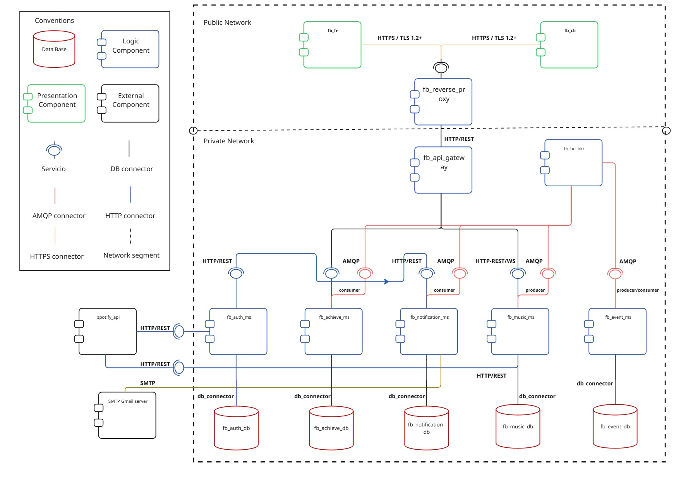

#### Descripción de elementos y relaciones arquitectónicas

##### Componentes de presentación
- `frontend/web` (React + Vite): interfaz web del lado del cliente utilizada por los usuarios finales para autenticarse, configurar preferencias, iniciar sesiones de entrenamiento, controlar la reproducción y revisar logros.
- `frontend/web-ssr` (Next.js): componente web con renderizado en servidor, utilizado como componente de presentación oficial para las entregas y verificaciones en tiempo de ejecución.
- `frontend/cli` (Node.js): cliente de línea de comandos que ejecuta flujos de autenticación, tablero, entrenamiento y control del reproductor.

##### Componentes de borde y orquestación
- `fb_gateway` (`traefik`): proxy inverso ubicado en el límite público. Recibe tráfico HTTP/HTTPS, termina TLS, aplica middleware CORS y reenvía el tráfico de API únicamente a KrakenD. También enruta el frontend SSR.
- `fb_api_gateway` (`krakend`): API Gateway y fachada de orquestación. Expone un contrato de endpoints explícito y enruta las solicitudes al servicio de backend correspondiente.
- `fb_rabbitmq` (`rabbitmq`): broker de mensajes asíncrono utilizado para la publicación y consumo de eventos entre servicios de backend.

##### Componentes de lógica
- `fb_auth_ms` (`user_service`, Python/FastAPI): gestiona usuarios, autenticación local, JWTs, OAuth de Spotify y endpoints internos de contacto y token.
- `fb_music_ms` (`music_service`, Go): gestiona sesiones de entrenamiento, orquestación de reproducción de Spotify, comandos de reproductor por WebSocket y publicación de eventos.
- `fb_achieve_ms` (`achievements_service`, .NET 8): evalúa reglas de logros, almacena el progreso de insignias y consume eventos relacionados con el entrenamiento.
- `fb_notification_ms` (`notification_service`, TypeScript/Node.js): consume eventos, obtiene datos de contacto del usuario mediante llamadas S2S autorizadas, persiste notificaciones y despacha mensajes de correo electrónico.
- `fb_event_ms` (`event-processor`, Java/Spring Boot): consume eventos de entrenamiento y calcula métricas y estadísticas derivadas.

##### Componentes de datos
- `fb_users_db` (PostgreSQL): datos de usuario, credenciales, tokens y preferencias.
- `fb_music_db` (CouchDB): documentos de sesiones de entrenamiento y sesiones musicales.
- `fb_achievements_db` (PostgreSQL): catálogo de logros, progreso y eventos de entrada procesados.
- `fb_notification_db` (PostgreSQL): registros de notificaciones e información de entrega.
- `fb_event_db` (PostgreSQL): registros de eventos procesados y métricas derivadas.

##### Sistemas externos
- API de Spotify: proveedor externo utilizado para OAuth, reproducción, información de pista actual y control musical.
- Proveedor de correo electrónico: servicio externo utilizado por el servicio de notificaciones para enviar mensajes.

##### Relaciones y conectores principales
| Conector | Productor | Consumidor | Descripción |
|---|---|---|---|
| Solicitud-respuesta HTTPS/HTTP | Clientes Web, SSR, CLI | Traefik | Los clientes externos acceden al sistema a través del proxy inverso. HTTPS se usa en escenarios de canal seguro. |
| Proxy inverso HTTP | Traefik | KrakenD | Traefik reenvía los prefijos de ruta de API a KrakenD y oculta la topología del backend. |
| REST/HTTP | KrakenD | Servicios de backend | KrakenD enruta los contratos públicos de API a `fb_auth_ms`, `fb_music_ms`, `fb_achieve_ms` y `fb_notification_ms`. |
| WebSocket | UI del reproductor / CLI | `fb_music_ms` a través de la ruta del gateway | Los comandos de reproducción en tiempo real se envían durante una sesión de entrenamiento activa. |
| AMQP | `fb_music_ms` y otros productores | Consumidores RabbitMQ | Los eventos de negocio se publican en colas/exchanges para procesamiento asíncrono. |
| Conectores de BD | Microservicios | Bases de datos propias | Cada servicio accede únicamente a su propio componente de persistencia. |
| API externa HTTPS | `fb_auth_ms`, `fb_music_ms` | API de Spotify | Interacciones de OAuth, renovación de tokens y reproducción. |
| HTTP interno + `X-Internal-Token` | `fb_notification_ms` | `fb_auth_ms` | Acceso autorizado de servicio a servicio a los datos de contacto internos. |

#### Descripción de estilos y patrones arquitectónicos utilizados
- **Estilo de microservicios:** FitBeat se descompone en servicios de backend desplegables de forma independiente, alineados con capacidades de negocio: identidad, entrenamiento/reproducción, logros, notificaciones y procesamiento de eventos.
- **Estilo cliente-servidor:** Los frontends actúan como clientes y los componentes de backend exponen interfaces HTTP/WebSocket a través de puntos de entrada controlados.
- **Arquitectura distribuida:** Los componentes se ejecutan en contenedores separados y se comunican a través de conectores de red, lo que introduce latencia y preocupaciones de fallo parcial gestionadas mediante contratos explícitos y mensajería asíncrona.
- **Colaboración orientada a eventos:** Los eventos de entrenamiento y de negocio se entregan a través de RabbitMQ para que los productores y consumidores no dependan de la disponibilidad mutua.
- **Patrón API Gateway:** KrakenD proporciona una única fachada de API y expone solo los endpoints en lista blanca.
- **Patrón Proxy Inverso:** Traefik protege el borde, termina TLS, aplica políticas de enrutamiento e impide que los clientes vean las direcciones internas de los servicios.
- **Patrón Broker:** RabbitMQ desacopla a los productores rápidos de los consumidores asíncronos.
- **Patrón Base de datos por servicio:** Cada servicio posee su propio límite de persistencia y evita el acoplamiento por base de datos compartida.
- **Patrón Canal Seguro:** HTTPS/TLS protege las solicitudes externas que pueden contener credenciales o tokens.
- **Patrón Token Secreto:** Los endpoints HTTP internos están protegidos con un encabezado `X-Internal-Token` compartido.

### 2. Estructura de Despliegue

#### Vista de Despliegue
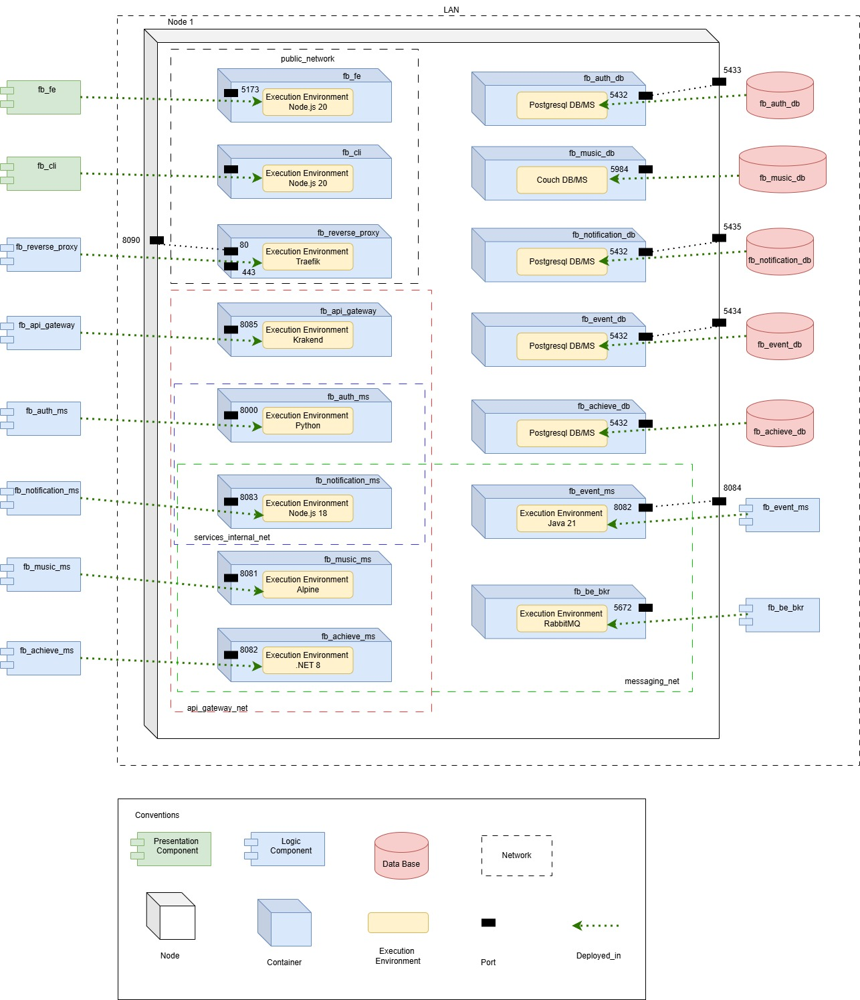

#### Descripción de elementos y relaciones arquitectónicas

##### Entorno de despliegue
El prototipo se despliega con Docker Compose en un único host. Cada componente principal se ejecuta en un contenedor independiente con su propia imagen de tiempo de ejecución, variables de entorno, puertos, comprobaciones de salud y membresías en redes Docker.

##### Nodos y contenedores
- Nodo host: máquina física o virtual que ejecuta Docker Engine y Docker Compose.
- `fb_reverse_proxy`: contenedor del proxy inverso Traefik.
- `fb_api_gateway`: contenedor del API Gateway KrakenD.
- `fb_fe`: contenedor del frontend React + Vite, utilizado bajo el perfil `legacy-csr`.
- `fb_cli`: contenedor del CLI Node.js.
- `fb_users_ms`, `fb_music_ms`, `fb_achievements_ms`, `fb_notification_ms`, `fb_events_ms`: contenedores de servicios de backend.
- `fb_users_db`, `fb_music_db`, `fb_achieve_db`, `fb_notification_db`, `fb_event_db`: contenedores de persistencia.
- `fb_be_bkr`: contenedor del broker AMQP y su interfaz de administración.

##### Entornos de ejecución
- Traefik v3.1 para proxy inverso, TLS y enrutamiento.
- KrakenD 2.7 para contratos de API gateway y reenvío al backend.
- Entorno Node.js para frontend CSR, frontend SSR, CLI y servicio de notificaciones.
- Python 3.11 + Uvicorn/FastAPI para el servicio de usuarios.
- Binario/entorno Go para el servicio de música.
- Entorno .NET 8 para el servicio de logros.
- Entorno Java 21 para el procesador de eventos.
- PostgreSQL, CouchDB y RabbitMQ para los servicios de infraestructura.

##### Redes
- `gateway_network`: zona DMZ/acceso público que contiene Traefik, KrakenD, frontends y CLI.
- `api_gateway_net`: zona de API interna que conecta KrakenD con los microservicios de backend.
- `users_db_net`, `music_db_net`, `achievements_db_net`, `notification_db_net`, `events_db_net`: redes de base de datos internas dedicadas a cada servicio y su base de datos.
- `messaging_net`: zona AMQP interna para RabbitMQ y los productores/consumidores de eventos.
- `services_internal_net`: canal interno explícito entre `fb_notification_ms_` y `fb_auth_ms`.

##### Relaciones de despliegue principales
- Clientes externos -> puertos del host `8090`/`443` -> `fb_gateway`.
- `fb_reverse_proxy` -> `fb_api_gateway` a través de `gateway_network`.
- `fb_api_gateway` -> microservicios de backend a través de `api_gateway_net`.
- Cada microservicio -> base de datos propia a través de su red interna de base de datos dedicada.
- Productores/consumidores de eventos -> `fb_be_bkr` a través de `messaging_net`.
- `fb_fe` -> Traefik/KrakenD usando `NEXT_PUBLIC_GATEWAY_URL`.

#### Descripción de patrones arquitectónicos utilizados
- **Despliegue basado en contenedores:** Cada componente de aplicación e infraestructura está empaquetado en un contenedor, haciendo las dependencias de tiempo de ejecución explícitas y reproducibles.
- **Despliegue con proxy inverso en el borde:** Traefik se despliega en el límite del sistema para recibir todo el tráfico externo y aplicar políticas de borde.
- **Despliegue de API Gateway:** KrakenD se despliega detrás de Traefik y es el único puente entre la red del gateway público y la red de API del backend.
- **Patrón de Segmentación de Red:** Las redes Docker crean zonas de confianza para ingreso público, enrutamiento de API, acceso a datos, mensajería y canales S2S explícitos.
- **Patrón de Almacenamiento Dedicado:** Cada almacén de datos se asigna al servicio de dominio que lo posee.
- **Despliegue de Defensa en Profundidad:** TLS, enrutamiento por proxy inverso, lista blanca de endpoints, aislamiento de red y validación de token compartido operan como capas de protección independientes.

### 3. Estructura en Capas

#### Vista en Capas
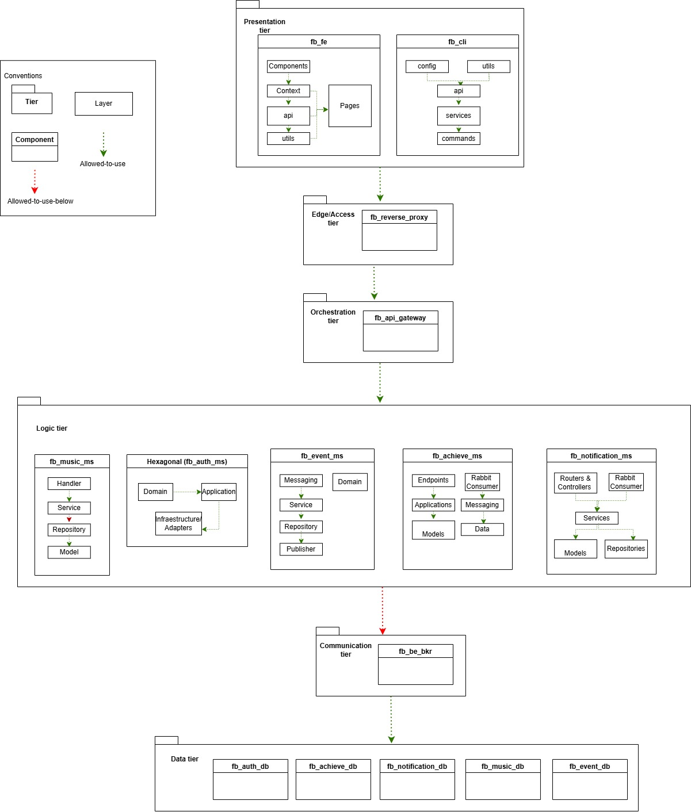

#### Descripción de elementos y relaciones arquitectónicas

##### Nivel 1 - Cliente / Presentación
- `frontend/web` y `frontend/cli`.
- Responsable de la interacción con el usuario, renderizado de UI, flujos de línea de comandos, visualización de sesiones y coordinación del lado del cliente.

##### Nivel 2 - Borde / Acceso
- `fb_reverse_proxy`.
- Responsable del punto de entrada público, exposición HTTP/HTTPS, terminación TLS, middleware CORS y enrutamiento de primer nivel.

##### Nivel 3 - Orquestación
- `fb_api_gateway` y `fb_be_bkr`.
- KrakenD orquesta el acceso sincrónico a la API exponiendo el contrato del backend y enrutando las solicitudes.
- RabbitMQ orquesta la colaboración asíncrona desacoplando productores y consumidores.

##### Nivel 4 - Servicios de Negocio
- `fb_auth_ms`, `fb_music_ms`, `fb_achieve_ms`, `fb_notification_ms` y `fb_event_ms`.
- Responsables de la lógica de aplicación y de dominio, validación específica del servicio, publicación/consumo de eventos e integración con APIs externas.

##### Nivel 5 - Infraestructura de Datos y Mensajería
- Bases de datos PostgreSQL, CouchDB y almacenamiento/colas de RabbitMQ.
- Responsables de la persistencia, durabilidad de eventos y gestión de datos a nivel de infraestructura.

##### Regla de dependencia
La relación de uso permitido fluye de los niveles superiores a los inferiores:

```text
Cliente / Presentación
  -> Borde / Acceso
      -> Orquestación
          -> Servicios de Negocio
              -> Infraestructura de Datos y Mensajería
```

Los servicios de backend también pueden usar el nivel de orquestación para la publicación/consumo asíncrono de eventos. El acceso directo de clientes a servicios de negocio o bases de datos no forma parte de la arquitectura prevista.

##### Capas lógicas internas en componentes seleccionados
- `frontend/cli`: `interfaz -> flujo de aplicación -> servicio -> integración de cliente -> interfaces externas`.
- `frontend/web-ssr`: `presentación renderizada en servidor -> integración del lado servidor -> API Gateway`.
- `api_gateway`: `contrato del gateway -> enrutamiento/composición -> integración con backend`.
- `reverse_proxy`: `entrada de borde -> enrutamiento -> middleware/política -> servicios upstream`.
- `fb_music_ms`: `manejador -> servicio -> repositorio -> modelo`, con acceso a nivel de servicio a los objetos del modelo.

#### Descripción de patrones arquitectónicos utilizados
- **Arquitectura N-capas:** El sistema está organizado en cinco niveles: presentación, borde/acceso, orquestación, servicios de negocio e infraestructura de datos.
- **Separación de capas de borde y orquestación:** El reverse proxy y la API gateway se ubican intencionalmente en niveles diferentes porque el reverse proxy gestiona las preocupaciones de acceso público mientras que la API gateway gestiona el contrato de API y el enrutamiento al backend.
- **Estilo en capas dentro de los servicios:** Los servicios de backend separan manejadores/controladores, servicios de aplicación, repositorios y modelos donde aplica.
- **Procesamiento orientado a eventos en capas:** Los consumidores de eventos actúan como puntos de entrada para flujos de trabajo asíncronos, mientras que la lógica de servicio y la persistencia permanecen separadas.
- **Regla de dependencia de uso permitido:** Los niveles superiores dependen de los inferiores a través de conectores explícitos HTTP, WebSocket, AMQP o de base de datos.

### 4. Estructura de Descomposición

#### Vista de Descomposición
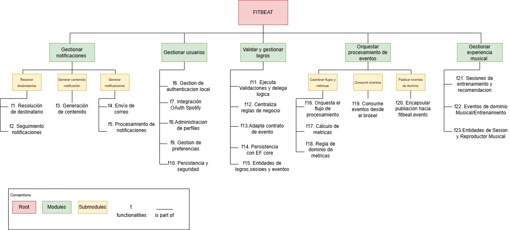

#### Descripción de elementos y relaciones arquitectónicas

##### Descomposición del sistema
- `Sistema FitBeat`
  - `Subsistema de Presentación`
    - Frontend web CSR (`frontend/web`)
    - Frontend web SSR (`frontend/web-ssr`)
    - Frontend CLI (`frontend/cli`)
  - `Subsistema de Borde y Acceso`
    - Proxy inverso (`traefik`)
    - Certificados TLS y middleware CORS
  - `Subsistema de Orquestación de API`
    - API Gateway (`krakend`)
    - Contratos de endpoints de API pública
  - `Subsistema de Identidad`
    - Servicio de usuarios
    - Base de datos de usuarios
    - Integración OAuth con Spotify
  - `Subsistema de Entrenamiento y Reproducción`
    - Servicio de música
    - Base de datos de música/sesiones
    - Control del reproductor por WebSocket
    - Integración de reproducción con Spotify
  - `Subsistema de Gamificación`
    - Servicio de logros
    - Base de datos de logros
  - `Subsistema de Notificaciones`
    - Servicio de notificaciones
    - Base de datos de notificaciones
    - Integración de correo electrónico
  - `Subsistema de Procesamiento Asíncrono`
    - Procesador de eventos
    - Base de datos de eventos
    - Colas/exchanges de RabbitMQ
  - `Subsistema de Infraestructura Compartida`
    - Redes Docker
    - Broker RabbitMQ
    - Secreto compartido de servicio a servicio

##### Relaciones principales
- El subsistema de presentación depende del subsistema de borde/acceso para el punto de entrada público.
- El subsistema de borde/acceso reenvía el tráfico de API a la orquestación y el tráfico SSR al frontend SSR.
- El subsistema de orquestación de API depende de los contratos de los servicios de backend.
- Los subsistemas de negocio poseen sus componentes de datos y no comparten esquemas de base de datos.
- El subsistema de entrenamiento/reproducción publica eventos consumidos por gamificación, notificaciones y procesamiento de eventos.
- El subsistema de notificaciones usa un canal interno explícito para solicitar datos de contacto del usuario al subsistema de identidad.
- Las integraciones externas están encapsuladas detrás de los servicios que las necesitan.

#### Descripción de patrones arquitectónicos utilizados
- **Descomposición funcional por capacidad de negocio:** Los servicios se organizan por responsabilidad de dominio: identidad, entrenamiento/reproducción, gamificación, notificaciones y métricas asíncronas.
- **Descomposición de infraestructura:** El borde, gateway, broker, redes, certificados y bases de datos se separan de los servicios de negocio.
- **Descomposición de integraciones:** Spotify y los proveedores de correo electrónico se modelan como sistemas externos y se acceden a través de lógica de integración propia de cada servicio.
- **Alta cohesión y bajo acoplamiento:** Cada subsistema posee una responsabilidad enfocada y se comunica a través de contratos REST, WebSocket, AMQP o S2S explícitos.
- **Base de datos por servicio:** La propiedad de los datos sigue los límites de los subsistemas.

## Atributos de Calidad

### Seguridad

#### Escenarios de seguridad

##### Escenario 1 - Patrón de Canal Seguro
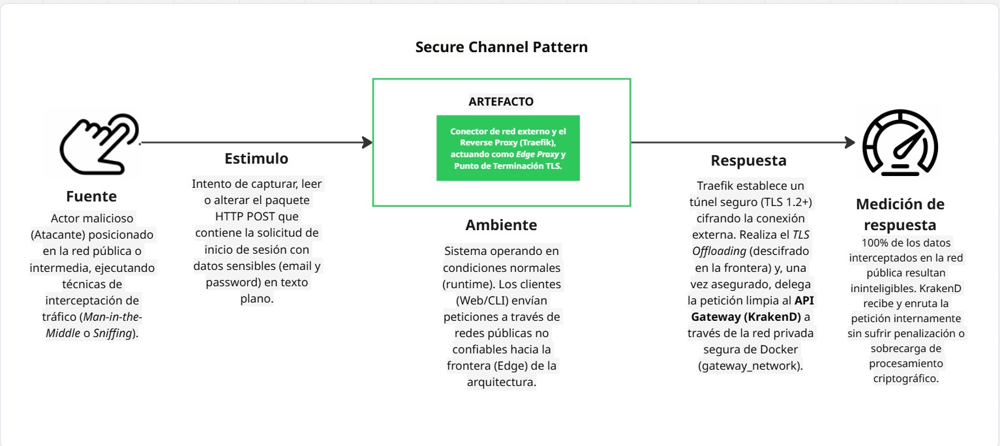

- **Debilidad:** El protocolo HTTP transmite datos en texto plano por diseño (RFC 2616). Los clientes web y CLI envían credenciales (correo electrónico, contraseña) y tokens de autenticación JWT hacia el sistema sin ningún mecanismo de cifrado nativo en la capa de transporte. Esta es una característica inherente al protocolo, no una configuración incorrecta del sistema.

- **Vulnerabilidad:** La debilidad queda expuesta porque los clientes se conectan desde redes públicas no controladas (Wi-Fi de cafeterías, redes móviles) donde el tráfico puede ser interceptado por terceros. El puerto `8090` de Traefik acepta tráfico HTTP sin redireccionamiento forzado a HTTPS, lo que permite que peticiones de inicio de sesión con credenciales en texto plano alcancen el sistema.

- **Riesgo:** Confidencialidad comprometida: las credenciales de acceso (correo electrónico y contraseña) y los tokens JWT transmitidos en texto plano pueden ser capturados por un atacante posicionado en la misma red, permitiéndole suplantar la identidad del usuario afectado o acceder a sus datos de entrenamiento y cuenta de Spotify vinculada.

- **Amenaza:** Un actor malicioso posicionado en la misma red (Wi-Fi pública, ISP comprometido) o con acceso a un nodo intermedio puede interceptar el tráfico entre el cliente y el gateway de FitBeat mediante técnicas de sniffing pasivo o ataques activos de intercepción.

- **Ataque:** Man-in-the-Middle (MitM) — el atacante intercepta la comunicación cliente-gateway y captura credenciales y datos sensibles en tránsito. Con acceso al token JWT, puede reutilizarlo para suplantar la sesión del usuario legítimo sin necesidad de conocer la contraseña.

- **Contramedida:** Patrón de Canal Seguro — implementación de TLS 1.2+ en Traefik (`fb_gateway`) con certificados propios de FitBeat. Traefik termina el canal seguro en el borde (puerto `443`), realiza TLS Offloading (descifrado en la frontera) y delega la petición de forma limpia internamente hacia KrakenD a través de la red privada de Docker (`gateway_network`). El 100% del tráfico que contiene credenciales o tokens viaja cifrado entre el cliente y el sistema.

Descripción: este escenario protege la confidencialidad e integridad del tráfico sensible de los usuarios. Surge de la evidencia de laboratorio donde HTTP en el puerto `8090` exponía las cargas de inicio de sesión en texto claro, mientras que HTTPS en el puerto `443` cifraba la misma información.

##### Escenario 2 - Patrón de Proxy Inverso
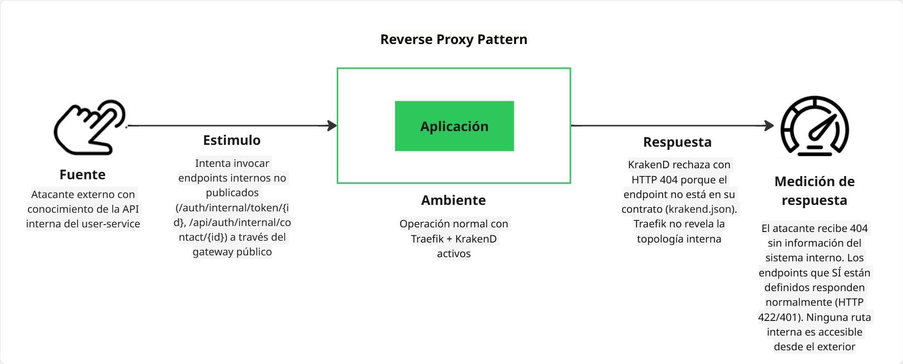

- **Debilidad:** Los microservicios de backend (`fb_auth_ms`, `fb_music_ms`, `fb_achieve_ms_`, `fb_notification_ms`) exponen sus endpoints HTTP internamente con rutas predecibles y sin mecanismos adicionales de autenticación de red propios. Por diseño, cada servicio confía en que solo el gateway autorizado puede alcanzarlos, lo que crea una dependencia implícita en el correcto aislamiento del enrutamiento.

- **Vulnerabilidad:** Si un atacante logra conocer o inferir los nombres de host internos de los servicios (por ejemplo, mediante la inspección de respuestas de error reveladoras, configuraciones expuestas o exploración de la red), podría intentar acceder directamente a endpoints no publicados en el contrato de KrakenD. La ausencia de un mecanismo de autenticación propio en cada servicio hace que la protección dependa exclusivamente de las capas de enrutamiento (Traefik + KrakenD).

- **Riesgo:** Exposición de la topología interna y acceso no autorizado a endpoints privados: un atacante que logre eludir la capa de proxy podría invocar rutas internas de administración, endpoints de salud detallados o funciones no publicadas del contrato de API, obteniendo información sensible o ejecutando operaciones no autorizadas.

- **Amenaza:** Un actor externo con conocimiento parcial de la topología interna del sistema, o un atacante que compromete un componente dentro de la red `gateway_network`, puede intentar realizar peticiones directas a los microservicios saltando las políticas de enrutamiento de Traefik y la lista blanca de KrakenD.

- **Ataque:** Bypass de rutas / Acceso directo al servicio — el atacante construye peticiones HTTP dirigidas directamente a los nombres de servicio internos (por ejemplo, `fb_auth_ms:8000`) o a rutas no listadas en `krakend.json`, intentando acceder a funcionalidad no expuesta públicamente o a información de diagnóstico del sistema.

- **Contramedida:** Patrón de Proxy Inverso — Traefik actúa como único punto de entrada público y solo conoce la dirección de KrakenD y del frontend SSR; los nombres y puertos de los microservicios de backend no son accesibles desde `gateway_network`. KrakenD aplica una lista blanca estricta de endpoints definidos en `krakend.json`, rechazando con `404 Not Found` cualquier ruta no declarada, sin revelar información sobre la topología interna ni los servicios existentes.

Descripción: Traefik es un proxy inverso puro en el borde. Conoce a KrakenD y al frontend SSR, pero no conoce las direcciones de los microservicios de backend. KrakenD aplica entonces la lista blanca del contrato de API.

##### Escenario 3 - Patrón de Segmentación de Red
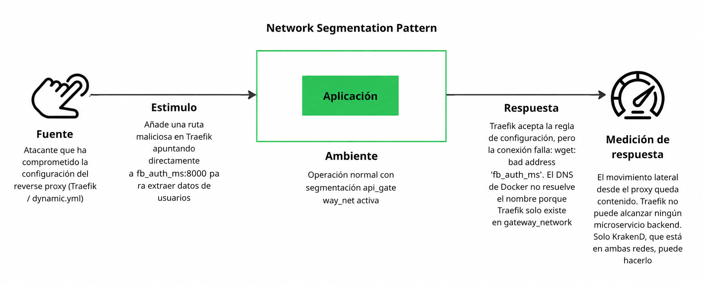

- **Debilidad:** En una arquitectura de microservicios con múltiples servicios y bases de datos en contenedores, la comunicación entre componentes es necesariamente amplia. Sin controles de red explícitos, todos los contenedores dentro de un mismo host Docker podrían potencialmente resolver los nombres de otros servicios y establecer conexiones TCP, lo que crea una superficie de ataque lateral muy amplia una vez que cualquier contenedor es comprometido.

- **Vulnerabilidad:** La vulnerabilidad se manifiesta cuando un contenedor comprometido (por ejemplo, `fb_notification_ms` explotado mediante una dependencia npm vulnerable) tiene visibilidad de red hacia componentes que no debería poder alcanzar, como la base de datos de usuarios (`fb_users_db`), el broker de mensajería (`fb_be_bkr`) o servicios internos de otros dominios. Sin segmentación, el movimiento lateral es técnicamente posible.

- **Riesgo:** Movimiento lateral post-compromiso: si un atacante obtiene ejecución de código en cualquier contenedor del sistema, puede explorar y atacar otros servicios y bases de datos accesibles desde ese contenedor, amplificando el impacto inicial de un único punto de compromiso hacia múltiples bases de datos, cuentas de Spotify o el broker de eventos.

- **Amenaza:** Un atacante que compromete un contenedor (ya sea por vulnerabilidad en la aplicación, dependencia o imagen base) intentará realizar reconocimiento de red interno y movimiento lateral hacia componentes de mayor valor, como las bases de datos de usuarios o el broker RabbitMQ, para extraer datos o interrumpir el servicio.

- **Ataque:** Movimiento Lateral / Escape de Contenedor — el atacante usa el contenedor comprometido como pivote para realizar escaneos de red internos, explotar servicios de base de datos accesibles o inyectar mensajes maliciosos en el broker de eventos, con el objetivo de comprometer datos de otros dominios del sistema.

- **Contramedida:** Patrón de Segmentación de Red — las redes Docker segmentan la arquitectura en zonas de confianza independientes: `gateway_network` (DMZ pública), `api_gateway_net` (zona de API interna), redes de base de datos dedicadas por servicio (`users_db_net`, `music_db_net`, etc.), `messaging_net` (zona de mensajería) y `services_internal_net` (canal S2S explícito). Cada contenedor pertenece únicamente a las redes necesarias para su función; por ejemplo, Traefik no puede resolver `fb_auth_ms` y `fb_notification_ms` no puede alcanzar `fb_users_db` directamente, limitando el radio de acción de un posible compromiso.

Descripción: este patrón limita el radio de daño de un compromiso. El sistema se divide en `gateway_network`, `api_gateway_net`, redes de base de datos propias de cada servicio, `messaging_net` y `services_internal_net`.

##### Escenario 4 - Patrón de Token Secreto para comunicación S2S
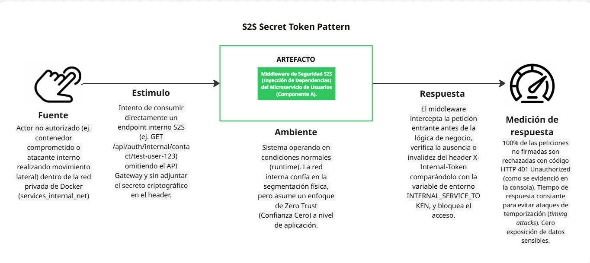

- **Debilidad:** Los endpoints internos de servicio a servicio (como `/api/auth/internal/contact/{user_id}` en `user-service`) deben ser accesibles para servicios legítimos del sistema (como `notification-service`) pero no pueden exponerse públicamente. La ubicación de red de un componente dentro de la red interna de Docker no es suficiente como prueba de identidad, ya que cualquier contenedor comprometido en `services_internal_net` podría realizar llamadas a estos endpoints.

- **Vulnerabilidad:** La debilidad se expone porque la red interna de Docker (`services_internal_net`) proporciona conectividad TCP pero no autenticación. Un contenedor comprometido o un proceso malicioso que logre acceso a dicha red puede invocar los endpoints internos de `fb_auth_ms` sin presentar ninguna credencial, obteniendo acceso a datos de contacto de usuarios (correo electrónico, información personal) necesarios para el envío de notificaciones.

- **Riesgo:** Acceso no autorizado a datos de usuario desde un servicio interno no legítimo: un atacante que controla un contenedor dentro de las redes internas puede extraer información de contacto de todos los usuarios del sistema invocando repetidamente el endpoint interno de `fb_auth_ms`, sin necesidad de comprometer la capa pública de autenticación JWT.

- **Amenaza:** Un actor malicioso con acceso a la red interna `services_internal_net` (ya sea por compromiso de un contenedor o por inserción de un contenedor malicioso en la red) puede intentar invocaciones directas a los endpoints internos de `fb_auth_ms` para extraer datos de contacto o ejecutar operaciones privilegiadas no destinadas al acceso público.

- **Ataque:** Acceso No Autorizado a API Interna — el atacante realiza peticiones HTTP directas al endpoint `/api/auth/internal/contact/{user_id}` omitiendo el encabezado `X-Internal-Token` o intentando valores arbitrarios, con el objetivo de extraer datos de usuarios, enumerar identificadores válidos o escalar el impacto de un compromiso de red interna hacia la exfiltración de datos personales.

- **Contramedida:** Patrón de Token Secreto — `fb_auth_ms` implementa un middleware de validación del encabezado `X-Internal-Token` usando comparación en tiempo constante (timing-safe) para evitar ataques de temporización. El secreto compartido (`FITBEAT_INTERNAL_SECRET`) es inyectado únicamente en los contenedores que necesitan comunicación S2S legítima a través de variables de entorno en el despliegue. Las peticiones sin el encabezado o con un valor incorrecto reciben `401 No Autorizado` antes de que se ejecute cualquier lógica de negocio, sin revelar información sobre la existencia o formato del token.

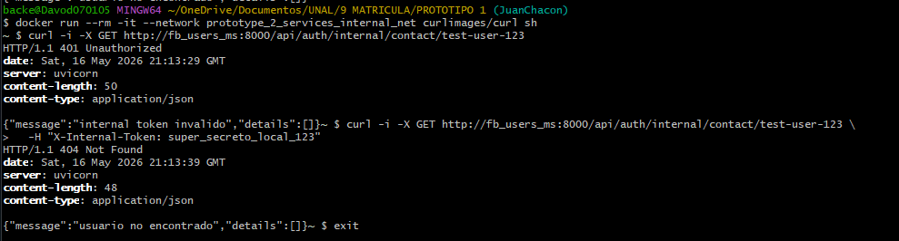
Descripción: la ubicación en la red no se trata como confianza. Incluso si un atacante alcanza una ruta interna, el servicio rechaza la solicitud a menos que el secreto compartido inyectado en el despliegue esté presente y sea válido.

#### Tácticas arquitectónicas aplicadas
- **Autenticar actores:** JWT autentica a los usuarios externos; `X-Internal-Token` autentica las llamadas internas de servicio a servicio.
- **Autorizar acceso:** KrakenD expone solo los endpoints en lista blanca y las rutas internas requieren autorización explícita.
- **Limitar el acceso:** Las redes Docker restringen qué contenedores pueden comunicarse entre sí.
- **Cifrar datos en tránsito:** TLS 1.2+ asegura el tráfico HTTP externo.
- **Limitar la exposición:** Traefik oculta las direcciones internas de los servicios y reenvía el tráfico de API del backend únicamente a KrakenD.
- **Detectar y rechazar accesos malformados:** El gateway y el middleware devuelven errores controlados para rutas desconocidas o no autorizadas.
- **Separar zonas de privilegio:** El borde público, el API gateway, las bases de datos, el broker y la comunicación S2S se ubican en diferentes zonas de red.

#### Patrones arquitectónicos aplicados
- **Patrón de Canal Seguro:** implementado con terminación HTTPS/TLS en Traefik y certificados de FitBeat.
- **Patrón de Proxy Inverso:** implementado con Traefik como componente de borde que oculta la topología del backend.
- **Patrón API Gateway:** implementado con KrakenD como contrato de API pública explícito.
- **Patrón de Segmentación de Red:** implementado con redes Docker que aíslan las zonas DMZ, API, datos, mensajería y S2S.
- **Patrón de Token Secreto / Secreto Compartido:** implementado con la variable de entorno `FITBEAT_INTERNAL_SECRET` y el encabezado `X-Internal-Token`.
- **Defensa en Profundidad:** combina TLS, enrutamiento por proxy inverso, lista blanca de endpoints, aislamiento de red y validación de token interno.
### Rendimiento y Escalabilidad

#### Escenarios de rendimiento

##### Escenario 1 - Inicio de sesión bajo carga concurrente normal
| Elemento | Descripción |
|---|---|
| Fuente | Usuarios concurrentes autenticándose en FitBeat. |
| Estímulo | Los usuarios envían solicitudes `POST /api/auth/login` con credenciales válidas. |
| Artefacto | Traefik, KrakenD, `fb_auth_ms` y PostgreSQL. |
| Ambiente | Operación normal con 1 y 50 usuarios virtuales generados por k6. |
| Respuesta | La solicitud cruza el borde público y el API Gateway, alcanza `fb_auth_ms`, valida al usuario en PostgreSQL y retorna un token de acceso. |
| Medida de respuesta | La tasa de error se mantiene en `0.0%`; la latencia p(95) se mantiene por debajo de 1 segundo durante la carga normal. |

##### Escenario 2 - Carga de estrés y punto de quiebre de la curva de rendimiento
| Elemento | Descripción |
|---|---|
| Fuente | Un evaluador de rendimiento que incrementa el tráfico concurrente de autenticación. |
| Estímulo | k6 escala de 1 a 50, 200, 500 y 2000 usuarios virtuales contra `POST /api/auth/login`. |
| Artefacto | Ruta de solicitud Traefik -> KrakenD -> `fb_auth_ms` -> PostgreSQL. |
| Ambiente | Ejecución de prueba de estrés con etapas de 30 segundos, usando un usuario de prueba pre-registrado y un segundo de tiempo de espera por iteración. |
| Respuesta | El sistema procesa las solicitudes hasta que la ruta de autenticación se satura; tras la saturación, la latencia se acerca al tiempo de espera de 10 segundos y las solicitudes comienzan a fallar. |
| Medida de respuesta | El punto de quiebre aparece en 200 VUs, donde p(95) salta a `8936 ms` y aparecen los primeros errores (`15.5%`). |

#### Tácticas arquitectónicas aplicadas
- **Introducir concurrencia:** k6 genera usuarios virtuales concurrentes para evaluar el comportamiento de la ruta de autenticación bajo demanda creciente.
- **Delimitar responsabilidades del servicio:** Cada microservicio se enfoca en una capacidad, reduciendo la contención y permitiendo el escalado independiente.
- **Centralizar el enrutamiento:** Traefik y KrakenD concentran las decisiones de enrutamiento público y exponen una ruta de solicitud controlada para el tráfico de autenticación.
- **Controlar la demanda durante ráfagas:** Los umbrales de k6 y los perfiles de carga escalonados hacen visible el punto de saturación antes de definir los objetivos de escalado horizontal.

#### Patrones arquitectónicos aplicados
- **Patrón de Microservicios:** los servicios independientes pueden escalarse según la carga específica del dominio.
- **Patrón de Base de Datos por Servicio:** cada servicio puede escalar su persistencia según su propio perfil de lectura/escritura.
- **Patrón API Gateway:** el tráfico de autenticación medido atraviesa KrakenD antes de llegar al servicio de identidad.

#### Análisis y resultados de las pruebas de rendimiento
Siguiendo el objetivo del laboratorio de identificar el punto de quiebre de la curva de rendimiento, la validación implementada utilizó k6 contra la ruta sincrónica de autenticación:

```text
k6 -> Traefik :8090 -> KrakenD :8085 -> user-service :8000 -> PostgreSQL
```

El endpoint medido fue `POST /api/auth/login`. Los scripts de prueba se encuentran en `performance-tests/k6`: `performance_test.js` define los perfiles parametrizados de línea base, carga y estrés; `case2_load.js` ejecuta 50 VUs durante 30 segundos; y `case3_stress.js` escala el sistema a través de 1, 50, 200, 500 y 2000 VUs. En `setup()`, k6 registra un usuario de prueba una sola vez; durante la prueba, cada VU realiza el inicio de sesión repetidamente y espera un segundo para simular el tiempo de reflexión del usuario. Las métricas medidas fueron `http_req_duration`, `http_req_failed`, tendencias personalizadas de duración del inicio de sesión, rendimiento y tasa de error.

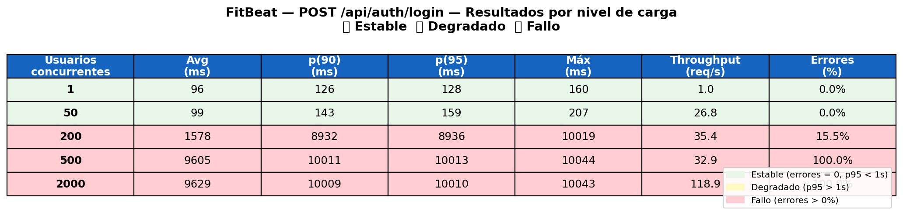


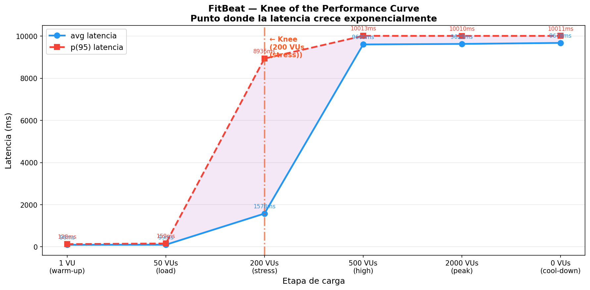

El sistema es estable con 1 y 50 VUs: p(95) se mantiene por debajo de 200 ms y no hay solicitudes fallidas. El punto de quiebre aparece en 200 VUs porque p(95) crece de 159 ms a 8936 ms y aparecen los primeros fallos con una tasa de error del 15.5%. A partir de 500 VUs, el endpoint ya no está degradado sino saturado: la latencia promedio se mantiene cerca de 9.6 segundos, p(95) ronda los 10 segundos y la tasa de error alcanza el 100%.

Este resultado indica que, para el despliegue actual con Docker Compose, la capacidad práctica de la ruta de autenticación es inferior a 200 usuarios concurrentes de inicio de sesión. El primer cuello de botella a investigar es la ruta sincrónica de `fb_auth_ms` y PostgreSQL detrás de KrakenD, ya que la prueba ejercita principalmente la validación de credenciales, la creación de tokens, el reenvío por el gateway y el acceso a la base de datos.

