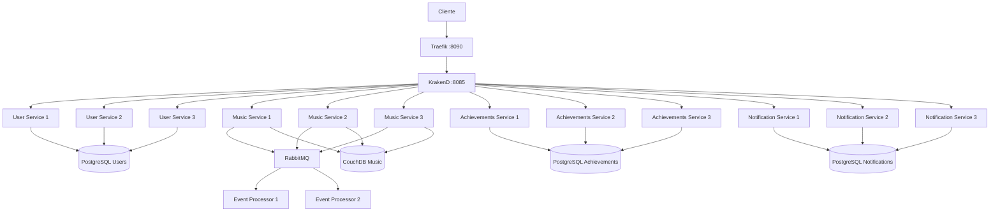
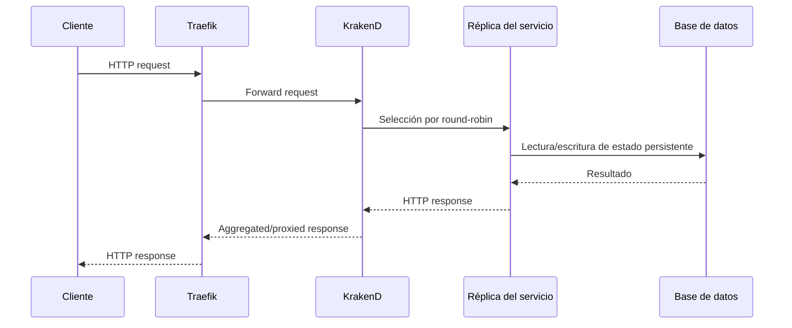

# Patrones de Escalamiento en FitBeat

## Resumen ejecutivo

Este directorio documenta cómo los conceptos del **Laboratorio 7: Scalability** fueron llevados a una implementación real dentro de FitBeat. El laboratorio propone demostrar escalamiento horizontal mediante réplicas idénticas y sin estado, un balanceador como punto único de entrada, identificación de instancia para observar la distribución y comparación entre distintos algoritmos de balanceo. En FitBeat, esos principios se materializan en una arquitectura de microservicios con **Traefik + KrakenD + servicios replicados**, manteniendo además una versión simplificada basada en Nginx en [`docker-compose-scaling.yml`](./docker-compose-scaling.yml) como puente conceptual con el ejercicio académico.

Este README prioriza la solución efectivamente implementada en FitBeat: **balanceo basado en KrakenD**, con Traefik como reverse proxy externo y múltiples réplicas por servicio. La demostración con Nginx no es el camino principal de despliegue del proyecto, sino una representación didáctica del patrón descrito en el laboratorio.

## Objetivo del laboratorio y adaptación a FitBeat

El laboratorio define tres objetivos técnicos principales:

1. **Escalamiento horizontal**: aumentar capacidad agregando instancias idénticas de un servicio sin estado.
2. **Balanceo de carga**: distribuir solicitudes entrantes entre varias réplicas.
3. **Identificación de instancia**: hacer visible qué réplica atendió una solicitud para validar el comportamiento del balanceador.

FitBeat adopta esos mismos principios, pero los adapta a una arquitectura distribuida más cercana a un entorno productivo:

| Concepto del laboratorio | Implementación en el laboratorio | Adaptación en FitBeat |
|---|---|---|
| Réplicas idénticas | `backend_1`, `backend_2`, `backend_3` | Tres réplicas para User, Music, Achievements y Notification; dos para Event Processor |
| Punto único de entrada | Nginx expuesto en puerto 80 | Traefik expuesto en `:8090`, reenviando a KrakenD en `:8085` |
| Balanceador | Nginx con `upstream` | KrakenD con múltiples `host` por endpoint y descubrimiento estático |
| Identificación de instancia | Respuesta JSON con nombre del contenedor | Variable `INSTANCE_ID` por réplica para trazabilidad operativa |
| Tolerancia a fallos | Detener una réplica y seguir atendiendo | Failover pasivo mediante KrakenD y servicios replicados |

La diferencia clave es arquitectónica: el laboratorio usa un único backend de ejemplo para enseñar el patrón; FitBeat lo aplica sobre varios microservicios, cada uno con su propia responsabilidad, persistencia y dependencias.

## Relación entre el patrón académico y la arquitectura real

En el laboratorio, el patrón es lineal:

```text
Cliente → Nginx → Pool de réplicas
```

En FitBeat, el patrón se integra dentro de una arquitectura más rica:

```text
Cliente → Traefik → KrakenD → Pool de microservicios replicados
```

Esto implica varias decisiones relevantes:

- el balanceo no ocurre en el borde externo, sino en la capa de gateway
- el sistema conserva la segmentación de red existente
- los servicios HTTP escalados siguen siendo sin estado
- el procesamiento asíncrono se escala por medio de consumidores múltiples en RabbitMQ
- la persistencia permanece desacoplada del ciclo de vida de cada réplica

En otras palabras, FitBeat no reemplaza el patrón del laboratorio: **lo generaliza y lo integra** en una arquitectura de microservicios ya existente.

## Arquitectura implementada

### Vista de despliegue



### Flujo lógico de una solicitud HTTP



## Servicios escalados y estrategia aplicada

| Servicio | Antes | Después | Estrategia |
|---|---:|---:|---|
| User Service (`component_a`) | 1 | 3 | Round-robin en KrakenD |
| Music Service | 1 | 3 | Round-robin en KrakenD |
| Achievements Service | 1 | 3 | Round-robin en KrakenD |
| Notification Service | 1 | 3 | Round-robin en KrakenD |
| Event Processor | 1 | 2 | Distribución por consumidores RabbitMQ |

### Justificación por tipo de servicio

#### Servicios HTTP
Los servicios User, Music, Achievements y Notification pueden escalar horizontalmente porque:
- no dependen de estado de sesión en memoria local
- almacenan el estado persistente fuera del proceso
- pueden atender solicitudes independientes desde cualquier réplica
- se benefician de repartir carga concurrente

#### Procesamiento asíncrono
El Event Processor no se balancea por HTTP, sino por consumo concurrente de mensajes. Aquí el patrón equivalente al escalamiento horizontal se expresa como:
- múltiples consumidores
- reparto natural del trabajo desde RabbitMQ
- aumento de throughput en procesamiento de eventos

## Decisiones arquitectónicas clave

### 1. Mantener Traefik y KrakenD en lugar de introducir Nginx en la ruta principal
El laboratorio usa Nginx porque es una forma simple de enseñar el patrón. FitBeat ya contaba con:
- **Traefik** como reverse proxy
- **KrakenD** como API Gateway

Introducir Nginx como balanceador principal habría duplicado responsabilidades y agregado complejidad operativa innecesaria. Por eso, la decisión fue reutilizar la capa de gateway existente y aprovechar la capacidad nativa de KrakenD para distribuir tráfico entre múltiples hosts backend.

### 2. Escalar solo servicios compatibles con el patrón
El escalamiento horizontal exige servicios sin estado o con estado externalizado. FitBeat cumple esto porque:
- el estado de usuarios, logros y notificaciones reside en PostgreSQL
- el estado musical reside en CouchDB
- los eventos se desacoplan mediante RabbitMQ
- las réplicas no dependen de memoria local compartida

### 3. Exponer solo la primera réplica para depuración
Aunque existen múltiples réplicas, solo la primera de ciertos servicios expone puertos al host. Esto responde a dos objetivos:
- facilitar depuración puntual
- mantener el acceso normal a través de la cadena Traefik → KrakenD

### 4. Usar `INSTANCE_ID` como mecanismo de observabilidad operativa
El laboratorio pide que la instancia activa sea observable. En FitBeat esto se resuelve con `INSTANCE_ID`, lo que permite:
- distinguir réplicas en logs
- verificar distribución
- correlacionar fallos o comportamientos anómalos
- simplificar troubleshooting

## Estrategia de balanceo en KrakenD

FitBeat utiliza **descubrimiento estático** en KrakenD mediante arreglos `host` por endpoint. Cuando un endpoint tiene varios hosts backend, KrakenD aplica **round-robin** como comportamiento por defecto.

Ejemplo representativo:

```json
{
  "endpoint": "/api/v1/sessions",
  "method": "POST",
  "backend": [{
    "url_pattern": "/api/v1/sessions",
    "host": [
      "http://music_service_1:8081",
      "http://music_service_2:8081",
      "http://music_service_3:8081"
    ],
    "encoding": "no-op",
    "sd": "static"
  }]
}
```

### Propiedades operativas de esta decisión

- **Distribución simple y predecible**: cada réplica recibe solicitudes en rotación.
- **Compatibilidad con servicios homogéneos**: si las réplicas tienen capacidad similar, round-robin es suficiente.
- **Sin afinidad de sesión**: adecuado porque los servicios son stateless.
- **Failover pasivo**: si una réplica falla, KrakenD puede dejar de usarla temporalmente.

## Comparación explícita de algoritmos: Round Robin, Least Connections e IP Hash

El laboratorio exige comparar tres algoritmos. A continuación se presenta esa comparación en el contexto de FitBeat.

| Algoritmo | Cómo funciona | Ventajas | Desventajas | Adecuación para FitBeat |
|---|---|---|---|---|
| Round Robin | Distribuye solicitudes en rotación secuencial | Simple, estable, fácil de operar | No considera duración real de cada request | **Alta** |
| Least Connections | Envía nuevas solicitudes a la réplica con menos conexiones activas | Mejor para cargas heterogéneas o tiempos variables | Requiere una semántica de balanceo más orientada al estado instantáneo del pool | Media |
| IP Hash | Asigna cliente a réplica según hash de IP | Proporciona afinidad de sesión | Puede sesgar distribución y no es ideal detrás de proxies/NAT | Baja |

### ¿Por qué FitBeat selecciona Round Robin?

#### Razón 1: los servicios HTTP son stateless
No existe necesidad de sticky sessions. Por tanto, IP Hash no aporta valor real y sí introduce riesgo de distribución desigual.

#### Razón 2: las réplicas son homogéneas
Las réplicas de cada servicio comparten la misma imagen, configuración base y responsabilidad funcional. En ese escenario, round-robin ofrece una política suficientemente buena con menor complejidad conceptual.

#### Razón 3: KrakenD ya es el gateway del sistema
La solución debía integrarse con la arquitectura existente. KrakenD soporta naturalmente múltiples hosts backend y round-robin por defecto, lo que reduce fricción de implementación.

#### Razón 4: el cuello de botella dominante no necesariamente está en el balanceador
En una arquitectura de microservicios, el límite puede desplazarse a:
- bases de datos
- colas de mensajes
- pools de conexiones
- latencia de red
- dependencias externas

Por ello, una política más sofisticada como Least Connections no garantiza una mejora material si el patrón de carga no lo exige.

#### Razón 5: simplicidad operativa y mantenibilidad
Desde una perspectiva arquitectónica, una solución más simple:
- es más fácil de explicar
- es más fácil de validar
- reduce superficie de error
- facilita troubleshooting y operación

## Puente conceptual con la demo Nginx del laboratorio

La carpeta incluye una implementación simplificada en:
- [`docker-compose-scaling.yml`](./docker-compose-scaling.yml)
- [`nginx/nginx.round-robin.conf`](./nginx/nginx.round-robin.conf)
- [`nginx/nginx.least-conn.conf`](./nginx/nginx.least-conn.conf)
- [`nginx/nginx.ip-hash.conf`](./nginx/nginx.ip-hash.conf)

Esa demo cumple una función pedagógica:
- aislar el patrón de escalamiento horizontal
- mostrar el efecto de cada algoritmo de balanceo
- reproducir fielmente el espíritu del laboratorio

Sin embargo, la implementación principal de FitBeat no usa Nginx como balanceador operativo, porque el sistema ya dispone de una capa gateway consolidada con KrakenD.

## Observabilidad y validación técnica

### Identificación de instancia

Cada réplica define un `INSTANCE_ID` único, por ejemplo:

```bash
INSTANCE_ID="user-service-1"
INSTANCE_ID="music-service-2"
INSTANCE_ID="achievements-service-3"
INSTANCE_ID="notification-service-1"
INSTANCE_ID="event-processor-2"
```

Esto permite:
- distinguir qué réplica atendió una solicitud
- analizar distribución de tráfico
- detectar fallos localizados
- correlacionar métricas y logs

### Qué métricas observar

1. **Distribución de solicitudes** entre réplicas
2. **Tiempos de respuesta** por servicio
3. **Tasa de errores** por réplica
4. **Uso de CPU y memoria**
5. **Consumo de conexiones a base de datos**
6. **Comportamiento del gateway ante fallos parciales**

## Métricas y expectativas de rendimiento

Según la documentación de implementación:

| Servicio | Antes | Después | Mejora esperada |
|---|---:|---:|---:|
| User Service | ~200 req/s | ~600 req/s | 3× |
| Music Service | ~100 req/s | ~300 req/s | 3× |
| Achievements Service | ~150 req/s | ~450 req/s | 3× |
| Notification Service | ~80 req/s | ~240 req/s | 3× |

### Interpretación arquitectónica

Estas cifras no deben leerse como garantía absoluta, sino como expectativa razonable bajo supuestos de:
- réplicas homogéneas
- recursos suficientes
- bases de datos capaces de absorber el incremento de concurrencia
- ausencia de cuellos de botella externos

El escalamiento horizontal mejora capacidad de cómputo distribuida, pero no elimina límites sistémicos. Si la base de datos o la cola se convierten en cuello de botella, el beneficio marginal de agregar réplicas disminuirá.

## Riesgos, limitaciones y trade-offs

### 1. Presión sobre bases de datos
Más réplicas implican más conexiones concurrentes. Esto puede requerir:
- ajustar `max_connections`
- reducir pool por réplica
- introducir pooling más sofisticado

### 2. Resolución DNS intermitente en Docker
La documentación reporta errores ocasionales de resolución en KrakenD. Aunque suelen recuperarse automáticamente, representan una consideración operativa real.

### 3. Distribución no perfectamente uniforme
Round-robin tiende a repartir de forma equilibrada, pero no garantiza igualdad exacta en ventanas pequeñas de observación.

### 4. El balanceador no resuelve todos los problemas de rendimiento
Si el cuello de botella está en persistencia, mensajería o dependencias externas, el beneficio del escalamiento de servicios HTTP será parcial.

## Conclusión

FitBeat implementa correctamente los principios del Laboratorio 7, pero lo hace en una forma más madura y arquitectónicamente integrada. El patrón de escalamiento horizontal no se limita a una demo aislada: se incorpora al gateway, a la segmentación de red, a la observabilidad y a la operación real del sistema.

Desde una perspectiva de arquitectura de software, la decisión de usar **KrakenD con round-robin** es coherente con:
- la naturaleza stateless de los servicios HTTP
- la topología existente del sistema
- la necesidad de minimizar complejidad adicional
- la búsqueda de mejoras simultáneas en rendimiento y disponibilidad

La demo con Nginx sigue siendo valiosa como instrumento pedagógico para comparar algoritmos, pero la solución principal de FitBeat demuestra cómo ese patrón académico puede evolucionar hacia una implementación práctica, mantenible y cercana a producción.