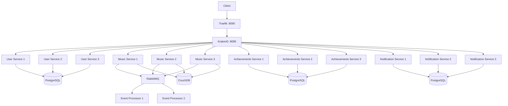

# FitBeat Scaling Patterns

## Overview

This directory documents how the concepts from **Laboratory 7: Scalability** were implemented in the FitBeat project. The lab introduces horizontal scaling with stateless replicas, a load balancer as the single entry point, observable instance identity, and comparative balancing strategies. FitBeat applies those same principles in a production-oriented microservices architecture using **Traefik + KrakenD + replicated backend services**, while also preserving the lab-style Nginx demonstration in [`docker-compose-scaling.yml`](./docker-compose-scaling.yml).

The implementation described here prioritizes the **actual FitBeat KrakenD-based solution** and uses the Nginx demo as the conceptual bridge to the original lab exercise.

## Relationship to Lab 7

Lab 7 defines three core ideas:

1. **Horizontal scaling** through multiple identical replicas of a stateless service.
2. **Load balancing** through a fronting component that distributes requests.
3. **Instance identification** so request distribution can be observed directly.

FitBeat maps those ideas as follows:

| Lab 7 concept | Lab artifact | FitBeat implementation |
|---|---|---|
| Stateless replicas | `backend_1`, `backend_2`, `backend_3` | Three replicas for User, Music, Achievements, and Notification services; two replicas for Event Processor |
| Single entry point | Nginx on port 80 | Traefik on `:8090`, forwarding to KrakenD on `:8085` |
| Load balancing | Nginx upstream algorithms | KrakenD static service discovery with round-robin across backend host arrays |
| Instance identification | Response includes instance name | `INSTANCE_ID` environment variable per replica for monitoring and debugging |
| Failure tolerance | Stop one backend and continue serving | Passive failover through KrakenD plus replicated services |

For the detailed implementation narrative, see:
- [`IMPLEMENTATION_KRAKEND_LB.md`](./IMPLEMENTATION_KRAKEND_LB.md)
- [`SCALING_IMPLEMENTATION_SUMMARY.md`](./SCALING_IMPLEMENTATION_SUMMARY.md)

## Implemented Architecture

### Production-oriented FitBeat scaling path



### Conceptual bridge to the lab

The lab uses **Nginx + three backend replicas** to demonstrate the same scaling pattern in a simpler environment. That version is preserved in:
- [`docker-compose-scaling.yml`](./docker-compose-scaling.yml)
- [`nginx/`](./nginx/)

This demo is useful for understanding the original academic pattern, while the KrakenD implementation shows how the same ideas were adapted to FitBeat’s real microservices topology.

## Services Scaled

| Service | Before | After | Strategy |
|---|---:|---:|---|
| User Service (`component_a`) | 1 | 3 | KrakenD round-robin |
| Music Service | 1 | 3 | KrakenD round-robin |
| Achievements Service | 1 | 3 | KrakenD round-robin |
| Notification Service | 1 | 3 | KrakenD round-robin |
| Event Processor | 1 | 2 | RabbitMQ consumer distribution |

## Load-Balancing Strategy

FitBeat uses **KrakenD static service discovery** with multiple backend hosts per endpoint. When several hosts are declared, KrakenD applies **round-robin** distribution by default.

### Request flow

1. Client sends a request to Traefik on port `8090`.
2. Traefik forwards the request to KrakenD on port `8085`.
3. KrakenD selects one replica from the configured host list.
4. The selected service processes the request.
5. The response returns through KrakenD and Traefik to the client.

### Why round-robin fits FitBeat

Round-robin is appropriate because:
- the HTTP services are designed to be **stateless**
- replicas are intended to be **homogeneous**
- there is **no session affinity requirement**
- it keeps the gateway configuration simple and predictable

## Configuration Summary

### Docker Compose scaling pattern

The implementation introduces:
- replica-specific service names such as `_1`, `_2`, `_3`
- unique `INSTANCE_ID` values per replica
- external ports only on the first replica of selected services for debugging
- KrakenD dependencies updated to include all replicas

### KrakenD configuration pattern

Each scaled endpoint includes multiple backend hosts and static discovery:

```json
{
  "endpoint": "/api/v1/sessions",
  "method": "POST",
  "backend": [{
    "url_pattern": "/api/v1/sessions",
    "host": [
      "http://music_service_1:8081",
      "http://music_service_2:8081",
      "http://music_service_3:8081"
    ],
    "encoding": "no-op",
    "sd": "static"
  }]
}
```

### Instance identification

Each replica exposes a unique logical identity through environment variables such as:

```bash
INSTANCE_ID="user-service-1"
INSTANCE_ID="music-service-2"
INSTANCE_ID="achievements-service-3"
```

This supports log correlation, debugging, and distribution analysis.

## Deployment

### Prerequisites

- Docker and Docker Compose
- Configured `.env` values
- Enough CPU and RAM for multiple replicas
- Optional tools: PowerShell, `curl.exe`, `ab`, `k6`

### Start the scaled environment

From the project root:

```powershell
docker-compose down
docker-compose up -d --build
docker-compose ps
```

### Verify the deployment

```powershell
docker-compose ps
docker-compose ps | Select-String "music_service|component_a|achievements_service|notification_service|event_processor"
docker-compose ps | Select-String "Exited|Down"
```

Expected result:
- all intended replicas appear as running
- KrakenD and Traefik are up
- the final command returns no matches for `Exited` or `Down`

## Testing Guide

The main automated validation is:

```powershell
cd .\scaling-patterns
bash .\test_load_balancing.sh
```

If Git Bash or WSL is not available, use the manual PowerShell procedures below.

Reference:
- [`test_load_balancing.sh`](./test_load_balancing.sh)

### 1. Service availability

```powershell
docker ps --format "{{.Names}}"
```

Expected result:
- containers such as `fb_users_ms_1`, `fb_music_ms_1`, `fb_achievements_ms_1`, `fb_notification_ms_1`, and `fb_api_gateway` are running

### 2. Health endpoint through the gateway

```powershell
for ($i=1; $i -le 5; $i++) {
  try {
    $resp = Invoke-RestMethod -Uri "http://localhost:8090/api/v1/health" -Method GET -ErrorAction Stop
    Write-Host "Request ${i}: OK - Status: $($resp.status)"
  } catch {
    Write-Host "Request ${i}: FAILED - $($_.Exception.Message)"
  }
}
```

Expected result:
- HTTP 200 responses
- healthy payload returned consistently
- no intermittent failures after startup stabilization

### 3. Verify load distribution on Music Service

Generate traffic:

```powershell
for ($i=1; $i -le 30; $i++) {
  try {
    Invoke-RestMethod -Uri "http://localhost:8090/api/v1/health" -Method GET -ErrorAction Stop | Out-Null
  } catch { }
}
```

Inspect logs:

```powershell
$ms1 = (docker logs fb_music_ms_1 2>&1 | Select-String "GET /api/v1/health" | Measure-Object).Count
$ms2 = (docker logs fb_music_ms_2 2>&1 | Select-String "GET /api/v1/health" | Measure-Object).Count
$ms3 = (docker logs fb_music_ms_3 2>&1 | Select-String "GET /api/v1/health" | Measure-Object).Count

Write-Host "Music Service 1: $ms1 requests"
Write-Host "Music Service 2: $ms2 requests"
Write-Host "Music Service 3: $ms3 requests"
```

Expected result:
- all three replicas receive requests
- counts are roughly balanced over a sufficient sample size

### 4. Verify load distribution on User Service

```powershell
for ($i=1; $i -le 30; $i++) {
  try {
    Invoke-WebRequest -Uri "http://localhost:8090/api/auth/me" -Method GET -ErrorAction Stop | Out-Null
  } catch { }
}
```

Then inspect:

```powershell
$us1 = (docker logs fb_users_ms_1 2>&1 | Select-String "/api/auth/me" | Measure-Object).Count
$us2 = (docker logs fb_users_ms_2 2>&1 | Select-String "/api/auth/me" | Measure-Object).Count
$us3 = (docker logs fb_users_ms_3 2>&1 | Select-String "/api/auth/me" | Measure-Object).Count

Write-Host "User Service 1: $us1 requests"
Write-Host "User Service 2: $us2 requests"
Write-Host "User Service 3: $us3 requests"
```

Expected result:
- requests appear across all replicas
- `401` responses are acceptable because the endpoint requires authentication
- the goal is distribution, not business success

### 5. Verify load distribution on Achievements Service

```powershell
for ($i=1; $i -le 30; $i++) {
  try {
    Invoke-RestMethod -Uri "http://localhost:8090/achievements/catalog" -Method GET -ErrorAction Stop | Out-Null
  } catch { }
}
```

Then inspect:

```powershell
$as1 = (docker logs fb_achievements_ms_1 2>&1 | Select-String "/achievements/catalog" | Measure-Object).Count
$as2 = (docker logs fb_achievements_ms_2 2>&1 | Select-String "/achievements/catalog" | Measure-Object).Count
$as3 = (docker logs fb_achievements_ms_3 2>&1 | Select-String "/achievements/catalog" | Measure-Object).Count

Write-Host "Achievements Service 1: $as1 requests"
Write-Host "Achievements Service 2: $as2 requests"
Write-Host "Achievements Service 3: $as3 requests"
```

Expected result:
- all replicas receive traffic
- distribution is approximately even

### 6. Verify KrakenD configuration at runtime

```powershell
docker exec fb_api_gateway sh -c "cat /etc/krakend/krakend.json" | Select-String "music_service_1|component_a_1|achievements_service_1"
```

Expected result:
- configured replica hostnames are present in the active KrakenD configuration

### 7. Monitor resource usage

```powershell
docker stats --no-stream
```

Expected result:
- replicas of the same service show comparable CPU and memory usage
- no single replica is disproportionately overloaded under balanced traffic

### 8. Optional failover validation

Stop one replica:

```powershell
docker-compose stop music_service_2
```

Send requests:

```powershell
for ($i=1; $i -le 10; $i++) {
  try {
    $response = Invoke-WebRequest -Uri "http://localhost:8090/api/v1/health" -Method GET -ErrorAction Stop
    Write-Host $response.StatusCode
  } catch {
    if ($_.Exception.Response) {
      Write-Host $_.Exception.Response.StatusCode.value__
    } else {
      Write-Host "FAILED"
    }
  }
}
```

Restart the replica:

```powershell
docker-compose start music_service_2
```

Expected result:
- requests continue succeeding while one replica is down
- the restarted replica eventually re-enters service rotation

### 9. Optional load testing

Using Apache Bench:

```bash
ab -n 300 -c 10 http://localhost:8090/api/v1/health
```

Using k6:

```powershell
cd .\performance-tests\k6
k6 run .\performance_test.js
```

Expected result:
- throughput improves relative to a single-instance baseline
- failed requests should remain minimal or zero
- response times should remain stable under moderate concurrency

## Expected Performance

Based on the implementation summary:

| Service | Before | After | Improvement |
|---|---:|---:|---:|
| User Service | ~200 req/sec | ~600 req/sec | 3× |
| Music Service | ~100 req/sec | ~300 req/sec | 3× |
| Achievements Service | ~150 req/sec | ~450 req/sec | 3× |
| Notification Service | ~80 req/sec | ~240 req/sec | 3× |

Actual results depend on:
- CPU cores available to Docker
- database connection pool sizing
- network latency
- request complexity
- downstream database performance

## Monitoring and Troubleshooting

### Useful commands

```powershell
docker-compose logs -f music_service_1 music_service_2 music_service_3
docker-compose logs krakend --tail 50
docker exec fb_api_gateway nslookup component_a_1
docker stats
```

### Common issues

#### Uneven distribution
- verify all replicas are running
- confirm KrakenD host arrays include every replica
- restart KrakenD if needed:
  ```powershell
  docker-compose restart krakend
  ```

#### DNS resolution issues in KrakenD
Symptoms may include intermittent `no such host` or temporary upstream failures.

Recommended actions:
```powershell
docker-compose restart krakend
docker-compose ps | Select-String "component_a"
docker-compose logs krakend --tail 50
docker exec fb_api_gateway nslookup component_a_1
```

#### Database connection pressure
If multiple replicas increase connection usage:
- increase database limits
- reduce per-replica pool size
- tune connection pooling based on load tests

## Lab Demo: Nginx Algorithm Comparison

The lab also requires comparing:
- **Round Robin**
- **Least Connections**
- **IP Hash**

That comparison is preserved in the Nginx demo under [`docker-compose-scaling.yml`](./docker-compose-scaling.yml) and the files in [`nginx/`](./nginx/). In FitBeat’s implemented architecture, the selected production-oriented strategy is **KrakenD round-robin**, because it aligns with stateless services and the existing API gateway layer.

## Rollback

If needed, restore the original single-instance configuration:

```powershell
docker-compose down
Copy-Item .\docker-compose.yml.backup .\docker-compose.yml -Force
Copy-Item .\krakend\krakend.json.backup .\krakend\krakend.json -Force
docker-compose up -d
```

## References

- [`IMPLEMENTATION_KRAKEND_LB.md`](./IMPLEMENTATION_KRAKEND_LB.md) — detailed implementation guide
- [`SCALING_IMPLEMENTATION_SUMMARY.md`](./SCALING_IMPLEMENTATION_SUMMARY.md) — implementation summary and production-readiness notes
- [`test_load_balancing.sh`](./test_load_balancing.sh) — automated validation script
- [`docker-compose-scaling.yml`](./docker-compose-scaling.yml) — Lab 7 conceptual bridge using Nginx
- [`../Lab7.pdf`](../Lab7.pdf) — original laboratory specification